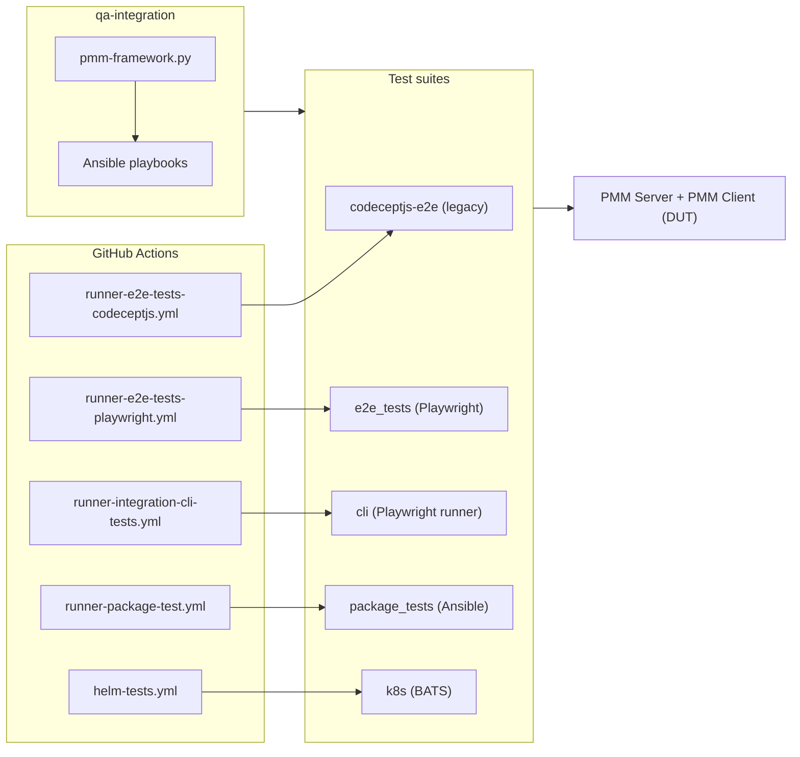

# PMM-QA Development Guide for AI Agents

## Maintaining This Document

This file is read by every AI agent at session start. **You are responsible for keeping it accurate.** After completing work, check whether any of these apply:

- Added, removed, or renamed a top-level directory or test suite

If any apply, update the relevant section of this file. Do **not** update for routine test additions or bug fixes that don't alter repo structure or conventions.

## How This Documentation Is Organized

This file is the **single authoritative entry point** for AI agents working with pmm-qa. It owns the product overview, repository map, and a consolidated per-suite quick-reference. Detailed suite docs live next to the suite's code (`README.md` / config file) — links are in the [Repository Map](#repository-map).

---

## Repository Overview

- **What**: QA repository for [Percona Monitoring and Management (PMM)](https://github.com/percona/pmm) — validates PMM Server + PMM Client across UI, CLI, infra provisioning, OS package install/upgrade, and Kubernetes helm-chart deployments.
- **Product source**: [percona/pmm](https://github.com/percona/pmm) monorepo plus companion `*_exporter` repos. For PMM-side architecture, domain model (Node → Service → Agent) and conventions, refer to [percona/pmm AGENTS.md](https://github.com/percona/pmm/blob/main/AGENTS.md).
- **Polyglot test repo**: TypeScript + Playwright, JavaScript + CodeceptJS, Python + Ansible, Bash + BATS.
- **Suite isolation**: each suite has its own dependency manifest, lint config and runner — **do not assume conventions cross between suites** unless this document explicitly says so.

## Repository Map

Each test suite has its own dependency manifest, lint config and runner. **Read the linked docs before contributing.** Most suites assume `pmm-framework.py` (under [qa-integration/](qa-integration/)) has already provisioned the required PMM Client and DB containers on the `pmm-qa` Docker network.

| Directory | Purpose | Docs / entry point |
|-----------|---------|--------------------|
| [cli/](cli/) | Playwright-runner CLI tests for `pmm-admin` (no browser) | [README.md](cli/README.md) · [playwright.config.ts](cli/playwright.config.ts) |
| [codeceptjs-e2e/](codeceptjs-e2e/) | **Legacy** CodeceptJS UI e2e suite — do not add new coverage unless extending an area that exists only here | [README.md](codeceptjs-e2e/README.md) · [CONTRIBUTING.md](codeceptjs-e2e/CONTRIBUTING.md) |
| [e2e_tests/](e2e_tests/) | **Active** Playwright UI e2e suite — preferred for all new UI tests | [playwright.config.ts](e2e_tests/playwright.config.ts) · [fixtures/pmmTest.ts](e2e_tests/fixtures/pmmTest.ts) · [pages/base.page.ts](e2e_tests/pages/base.page.ts) |
| [qa-integration/](qa-integration/) | `pmm-framework.py` + Ansible playbooks to provision PMM Clients and monitored DBs on the `pmm-qa` Docker network | [pmm_qa/README.md](qa-integration/pmm_qa/README.md) · [scripts/database_options.py](qa-integration/pmm_qa/scripts/database_options.py) · [pmm_pgsm_setup/readme.md](qa-integration/pmm_pgsm_setup/readme.md) · [pmm_psmdb-pbm_setup/readme.md](qa-integration/pmm_psmdb-pbm_setup/readme.md) |
| [package_tests/](package_tests/) | Ansible playbooks for OS-level pmm-client install + upgrade (deb/rpm/tarball, auth modes, custom path/port, GSSAPI) | [pmm3-client_integration.yml](package_tests/pmm3-client_integration.yml) |
| [k8s/](k8s/) | BATS helm-chart smoke + functional tests against a local Kubernetes cluster | [helm-test.bats](k8s/helm-test.bats) |
| [support_scripts/](support_scripts/) | Ad-hoc Python helpers for manual / CI debugging (not part of any suite) | [agent_status.py](support_scripts/agent_status.py) · [check_client_upgrade.py](support_scripts/check_client_upgrade.py) · [check_upgrade.py](support_scripts/check_upgrade.py) |
| [.github/workflows/](.github/workflows/) | GitHub Actions pipelines | See [CI / Pipeline Map](#ci--pipeline-map) below |

## Cross-Suite Architecture

`pmm-framework.py` is the common provisioning step for most CI jobs: it stands up PMM Client containers and monitored DBs on a shared Docker network named `pmm-qa`, then the respective UI / CLI suite runs against that environment.

## CI / Pipelines

All CI runs are GitHub Actions workflows under [.github/workflows/](.github/workflows/). Naming convention:

- `runner-*.yml` — **reusable** workflow that runs one suite (drives codeceptjs-e2e, e2e_tests, cli, package_tests, easy-install).
- `fb-*.yml` — **feature-build** wrappers invoking a runner against a PR build.
- `*-matrix*.yml` — matrix wrappers fanning a runner across versions/OS/arch.
- `helm-tests.yml` — the only k8s entry point.
- `rc-testing-suite.yml` — GitHub Actions portion of RC testing (see [External RC orchestration](#external-rc-orchestration) below).
- `pmm-version-getter.yml` — reusable version-discovery helper.

To find the entry workflow for a suite, search `runner-<suite>*.yml` in [.github/workflows/](.github/workflows/).

### External RC orchestration

Full Release-Candidate testing is **not** driven from this repo. The orchestrator is the Jenkins pipeline [`Percona-Lab/jenkins-pipelines` › `pmm/v3/pmm3-rc-testing.groovy`](https://github.com/Percona-Lab/jenkins-pipelines/blob/master/pmm/v3/pmm3-rc-testing.groovy). For a given `RC_VERSION` it runs three parallel lanes:

- **Lane 1**: `pmm3-ui-tests-nightly` against the AMI plus the last 5 GA `percona/pmm-client` tags (backward-compatibility).
- **Lane 2**: `pmm3-ui-tests-nightly` for OVF / Docker / Helm / HA, `pmm3-ui-tests-nightly-gssapi`, `openshift-helm-tests`.
- **Lane 3**: `pmm3-migration-tests`, `pmm3-ui-tests-matrix`, `pmm3-upgrade-ami-test`, `pmm3-package-testing-matrix` (amd64 + arm64), `pmm3-upgrade-tests-matrix`, and a GitHub-API dispatch of [`rc-testing-suite.yml`](.github/workflows/rc-testing-suite.yml).
