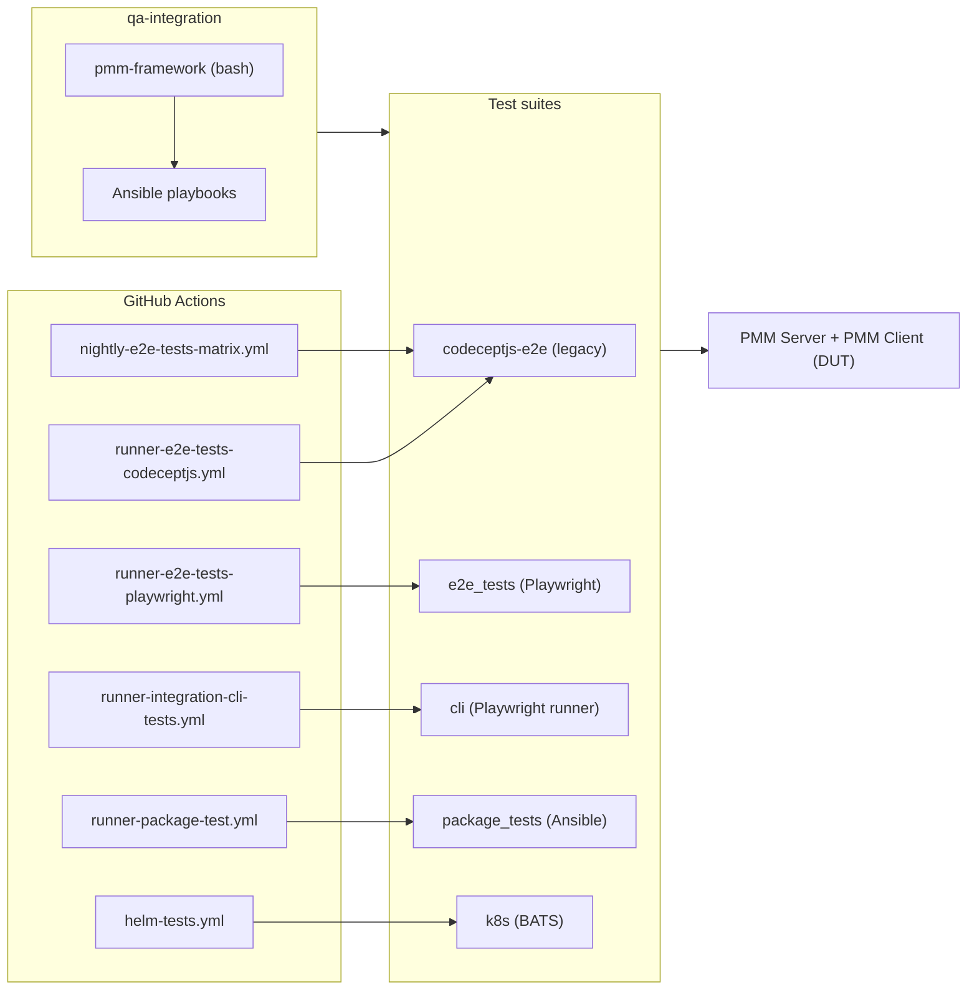

# PMM-QA Development Guide for AI Agents

<!-- SINGLE ENTRY POINT for all AI coding assistants (Claude Code, Cursor, GitHub Copilot, etc.)
     Compatibility shims: CLAUDE.md, .cursorrules, .github/copilot-instructions.md
     Last reviewed: 2026-07 -->

## Maintaining This Document

This file is read by every AI agent at session start. **You are responsible for keeping it accurate.** After completing work, check whether any of these apply:

- Added, removed, or renamed a top-level directory or test suite
- Changed CI workflow naming conventions or entry points
- Changed shared environment variables or test-runner defaults

If any apply, update the relevant section of this file. Do **not** update for routine test additions or bug fixes that don't alter repo structure or conventions.

## How This Documentation Is Organized

This file is the **single authoritative entry point** for AI agents working with pmm-qa. It owns the product overview, repository map, and a consolidated per-suite quick-reference. Detailed suite docs live next to the suite's code (`README.md` / config file) — links are in the [Repository Map](#repository-map).

---

## Repository Overview

- **What**: QA repository for [Percona Monitoring and Management (PMM)](https://github.com/percona/pmm) — validates PMM Server + PMM Client across UI, CLI, infra provisioning, OS package install/upgrade, and Kubernetes helm-chart deployments.
- **Product source**: [percona/pmm](https://github.com/percona/pmm) monorepo plus companion `*_exporter` repos. For PMM-side architecture, domain model (Node → Service → Agent) and conventions, refer to [percona/pmm AGENTS.md](https://github.com/percona/pmm/blob/main/AGENTS.md).
- **Polyglot test repo**: TypeScript + Playwright, JavaScript + CodeceptJS, Python + Ansible, Bash + BATS.
- **Suite isolation**: each suite has its own dependency manifest, lint config and runner — **do not assume conventions cross between suites** unless this document explicitly says so.

## Repository Map

Each test suite has its own dependency manifest, lint config and runner. **Read the linked docs before contributing.** Most suites assume `pmm-framework` (the bash CLI under [qa-integration/](qa-integration/)) has already provisioned the required PMM Client and DB containers on the `pmm-qa` Docker network.

| Directory | Purpose | Docs / entry point |
|-----------|---------|--------------------|
| [cli/](cli/) | Playwright-runner CLI tests for `pmm-admin` (no browser) | [README.md](cli/README.md) · [playwright.config.ts](cli/playwright.config.ts) |
| [codeceptjs-e2e/](codeceptjs-e2e/) | **Legacy** CodeceptJS UI e2e suite — do not add new coverage unless extending an area that exists only here | [README.md](codeceptjs-e2e/README.md) · [CONTRIBUTING.md](codeceptjs-e2e/CONTRIBUTING.md) |
| [e2e_tests/](e2e_tests/) | **Active** Playwright UI e2e suite — preferred for all new UI tests | [README.md](e2e_tests/README.md) · [CONTRIBUTING.md](e2e_tests/CONTRIBUTING.md) · [playwright.config.ts](e2e_tests/playwright.config.ts) · [fixtures/pmmTest.ts](e2e_tests/fixtures/pmmTest.ts) |
| [qa-integration/](qa-integration/) | `pmm-framework` (bash CLI) + Ansible playbooks to provision PMM Clients and monitored DBs on the `pmm-qa` Docker network | [pmm-framework/README.md](qa-integration/pmm_qa/pmm-framework/README.md) · [pmm_qa/README.md](qa-integration/pmm_qa/README.md) · [scripts/database_options.py](qa-integration/pmm_qa/scripts/database_options.py) |
| [package_tests/](package_tests/) | Ansible playbooks for OS-level pmm-client install + upgrade (deb/rpm/tarball, auth modes, custom path/port, GSSAPI) | [pmm3-client_integration.yml](package_tests/pmm3-client_integration.yml) |
| [k8s/](k8s/) | BATS helm-chart smoke + functional tests against a local Kubernetes cluster | [helm-test.bats](k8s/helm-test.bats) |
| [support_scripts/](support_scripts/) | Ad-hoc Python helpers for manual / CI debugging (not part of any suite) | [agent_status.py](support_scripts/agent_status.py) · [check_client_upgrade.py](support_scripts/check_client_upgrade.py) · [check_upgrade.py](support_scripts/check_upgrade.py) |
| [.agents/](.agents/) | Agent workflow prompts and MCP configuration for LLM-assisted test development | [README.md](.agents/README.md) · [workflows/](.agents/workflows/) |
| [.github/workflows/](.github/workflows/) | GitHub Actions pipelines | See [CI / Pipelines](#ci--pipelines) below |

## Cross-Suite Architecture


```mermaid
flowchart LR
    subgraph Drivers["GitHub Actions"]
        ghaCjs["runner-e2e-tests-codeceptjs.yml"]
        ghaPw["runner-e2e-tests-playwright.yml"]
        ghaCli["runner-integration-cli-tests.yml"]
        ghaPkg["runner-package-test.yml"]
        ghaHelm["helm-tests.yml"]
        ghaNightly["nightly-e2e-tests-matrix.yml"]
    end

    subgraph Setup["qa-integration"]
        framework["pmm-framework (bash)"]
        ansible["Ansible playbooks"]
        framework --> ansible
    end

    subgraph Suites["Test suites"]
        cjs["codeceptjs-e2e (legacy)"]
        e2e["e2e_tests (Playwright)"]
        cli["cli (Playwright runner)"]
        pkg["package_tests (Ansible)"]
        helm["k8s (BATS)"]
    end

    Setup --> Suites
    ghaCjs --> cjs
    ghaPw --> e2e
    ghaCli --> cli
    ghaPkg --> pkg
    ghaHelm --> helm
    ghaNightly --> cjs
    Suites --> DUT["PMM Server + PMM Client (DUT)"]
```

`pmm-framework` (the bash CLI at [qa-integration/pmm_qa/pmm-framework/](qa-integration/pmm_qa/pmm-framework/)) is the common provisioning step for most CI jobs: it stands up PMM Client containers and monitored DBs on a shared Docker network named `pmm-qa`, then the respective UI / CLI suite runs against that environment.

## CI / Pipelines

All CI runs are GitHub Actions workflows under [.github/workflows/](.github/workflows/) (24 workflow files). Naming convention:

- `runner-*.yml` — **reusable** workflow that runs one suite (drives codeceptjs-e2e, e2e_tests, cli, package_tests, easy-install, podman).
- `fb-*.yml` — **feature-build** wrappers invoking a runner against a PR build.
- `*-matrix*.yml` — matrix wrappers fanning a runner across versions/OS/arch.
- `nightly-e2e-tests-matrix.yml` — remote nightly E2E matrix (triggered by Jenkins after PMM Server is up).
- `runner-e2e-tests-codeceptjs-remote-nightly-*.yml` — nightly remote setup and test runners for CodeceptJS.
- `helm-tests.yml` — the only k8s entry point.
- `rc-testing-suite.yml` — GitHub Actions portion of RC testing (see [External RC orchestration](#external-rc-orchestration) below).
- `pmm-version-getter.yml` — reusable version-discovery helper.
- `PMM_*.yml` / `PMM_*.yaml` — database-specific integration workflows (e.g. PDPGSQL, PROXYSQL, PSMDB PBM).

To find the entry workflow for a suite, search `runner-<suite>*.yml` in [.github/workflows/](.github/workflows/).

### External RC orchestration

Full Release-Candidate testing is **not** driven from this repo. The orchestrator is the Jenkins pipeline [`Percona-Lab/jenkins-pipelines` › `pmm/v3/pmm3-rc-testing.groovy`](https://github.com/Percona-Lab/jenkins-pipelines/blob/master/pmm/v3/pmm3-rc-testing.groovy). For a given `RC_VERSION` it runs three parallel lanes:

- **Lane 1**: `pmm3-ui-tests-nightly-gha` against the AMI plus the last 5 GA `percona/pmm-client` tags (backward-compatibility; compat lanes skipped on patch RCs).
- **Lane 2**: `pmm3-ui-tests-nightly-gha` for OVF / Docker / Helm / HA, `pmm3-ui-tests-nightly-gssapi`, `openshift-helm-tests`.
- **Lane 3**: `pmm3-ui-tests-matrix`, `pmm3-upgrade-ami-test`, `pmm3-package-testing-matrix` (amd64 + arm64), `pmm3-upgrade-tests-matrix`, and a GitHub-API dispatch of [`rc-testing-suite.yml`](.github/workflows/rc-testing-suite.yml).

**Patch RCs** (`x.y.z` where only `z` changes vs the latest GA): Lane 1 compat nightly stages and the `compatibility_integration_tests` job in `rc-testing-suite.yml` are skipped (`skip_compatibility=true`). Minor/major RCs keep full compatibility coverage.

## Playwright E2E Suite (`e2e_tests/`)

Preferred location for all new UI tests. See [e2e_tests/README.md](e2e_tests/README.md) for full setup and run instructions.

### Configuration highlights

- **Config**: [e2e_tests/playwright.config.ts](e2e_tests/playwright.config.ts)
- **Base URL**: `PMM_UI_URL` env var (default `http://localhost/`)
- **Browser**: Chromium only
- **Workers**: `WORKERS` env var (default `1`; CI workflows also default to `1`)
- **Retries**: `2` in CI, `0` locally
- **Reporters**: list + HTML + JSON (CI uses Launchable for test subsetting)
- **Fixtures**: use `pmmTest` from `@fixtures/pmmTest` — not raw `test` from `@playwright/test`

### Test areas (`e2e_tests/tests/`)

| Area | Path | Notes |
|------|------|-------|
| Access control | `accessControl/` | LBAC and permissions |
| Alerting | `api/alerting/` | Alerting permissions API |
| Dashboards | `dashboards/` | MySQL, Valkey, image renderer |
| Docker config | `dockerConfiguration/` | ClickHouse, srv folder |
| HA settings | `ha/` | High-availability settings |
| Inventory | `inventory/` | Nodes, services, agents |
| Navigation | `navigation.test.ts` | New navigation |
| QAN | `qan/` | RTA, stored metrics |
| Post-release | `postRelease.test.ts` | GA validation (`@post-release`) |
| Standalone | `standalone/` | Screenshot capture utilities |

### Page Object Model

Tests use class-based page objects in `e2e_tests/pages/`:
- Page classes encapsulate selectors and actions
- Locators use `data-testid` attributes where available
- Path aliases: `@pages/*`, `@helpers/*`, `@fixtures/*` (via `tsconfig.json`)
- For POM conventions, see [e2e_tests/CONTRIBUTING.md](e2e_tests/CONTRIBUTING.md) and [.agents/workflows/pomRules.md](.agents/workflows/pomRules.md)

### Test tags

Tests are filtered by tags in titles or annotations. CI workflows use `--grep @tag` for selective runs. Common tags: `@dashboards`, `@qan`, `@inventory`, `@settings`, `@rta`, `@post-release`, `@ha-settings`, `@docker-configuration`, `@nightly`. Full list in [e2e_tests/README.md](e2e_tests/README.md).

### Running locally

```bash
cd e2e_tests
npm ci
npx playwright install-deps
npx playwright install chromium
docker compose up -d   # optional: local PMM Server
npx playwright test
npx playwright test --grep @inventory
```

## Helm / Kubernetes Tests (`k8s/`)

- **Framework**: [Bats](https://github.com/bats-core/bats-core) (Bash Automated Testing System)
- **Target**: PMM Helm chart on minikube
- **Helpers**: `pmm_helper.sh`, `k8s_helper.sh` for cluster and PMM operations
- **CI**: [.github/workflows/helm-tests.yml](.github/workflows/helm-tests.yml)

## Patterns and Conventions

### Do
- Use the **Page Object Model** for Playwright browser tests — put selectors and actions in `pages/`
- Use **`data-testid`** locators (stable, not CSS-class dependent)
- Tag tests for CI filtering (`@inventory`, `@dashboards`, `@qan`, etc.)
- Make tests **idempotent** — clean up created resources
- Use `e2e_tests/api/` helpers for test setup/teardown via REST API
- Use path aliases (`@pages/`, `@helpers/`) in imports
- Use Playwright's `test.step()` for readable test structure
- Read suite-specific docs before contributing to `cli/`, `codeceptjs-e2e/`, or `package_tests/`

### Don't
- Don't use CSS class selectors for Grafana elements (they change across versions)
- Don't hardcode PMM Server URLs — use `PMM_UI_URL` env var
- Don't hardcode admin passwords — use `ADMIN_PASSWORD` env var (default `admin`)
- Don't skip cleanup — CI runs accumulate state across tests
- Don't mix Playwright Test and CodeceptJS patterns — new UI tests go in `e2e_tests/` (Playwright)

## Environment Variables

| Variable | Default | Purpose |
|----------|---------|---------|
| `PMM_UI_URL` | `http://localhost/` | PMM Server URL |
| `ADMIN_PASSWORD` | `admin` | Grafana/PMM admin password |
| `WORKERS` | `1` | Playwright parallel workers |
| `HEADLESS` | `true` | Browser visibility (`false` for headed) |
| `DOCKER_VERSION` | `perconalab/pmm-server:3-dev-latest` | PMM Server Docker image (local compose) |
| `PMM_SERVER_LATEST` | — | Required for `@post-release` tests |

## Key Files to Reference

- [e2e_tests/playwright.config.ts](e2e_tests/playwright.config.ts) — Playwright configuration
- [e2e_tests/fixtures/pmmTest.ts](e2e_tests/fixtures/pmmTest.ts) — shared test fixtures
- [e2e_tests/docker-compose.yml](e2e_tests/docker-compose.yml) — local PMM Server environment
- [k8s/helm-test.bats](k8s/helm-test.bats) — Helm chart test suite
- [.github/workflows/runner-e2e-tests-playwright.yml](.github/workflows/runner-e2e-tests-playwright.yml) — reusable Playwright CI runner
- [.agents/README.md](.agents/README.md) — LLM workflow prompts and MCP config
