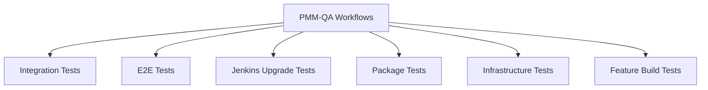

# PMM-QA Testing Documentation

Welcome to the PMM-QA comprehensive testing documentation. This directory contains detailed guides for running various types of tests in the PMM (Percona Monitoring and Management) QA repository.

## ⚠️ **Important Notice: Legacy Tests Deprecation**

> **DEPRECATION NOTICE**: The `pmm-tests/` directory containing BATS (Bash Automated Testing System) tests is **deprecated** and should not be used for new test development.
> 
> **Use instead**: 
> - **CLI Testing**: TypeScript/Playwright tests in `cli-tests/` (see [Integration & CLI Tests](integration-cli-tests.md))
> - **UI Testing**: CodeceptJS tests (see [End-to-End Tests](e2e-tests.md))
> - **Infrastructure Setup**: Python framework in `qa-integration/pmm_qa/` and other Percona QA team setups (see [Adding New Environments](adding-new-environments.md))
>
> **Status**: 
> - ✅ **pmm-ui-tests/cli-tests** - Current CLI testing framework  
> - ✅ **pmm-ui-tests/** - Current UI testing framework (CodeceptJS)
> - ✅ **qa-integration/pmm_qa/** - Current infrastructure framework
> - ✅ **qa-integration/pmm_psmdb_diffauth_setup and etc..** - Other Percona QA team setups

## 📚 **Documentation Overview**

This documentation is organized by test type to provide focused guidance for different testing scenarios:

### **Core Testing Guides**

| Document | Description | Use Case |
|----------|-------------|----------|
| [Integration & CLI Tests](integration-cli-tests.md) | PMM CLI functionality testing | Daily development validation |
| [End-to-End Tests](e2e-tests.md) | UI testing with CodeceptJS | Feature validation |
| [Upgrade Tests](upgrade-tests.md) | PMM upgrade scenarios | Upgrade validation |
| [Package Tests](package-tests.md) | Package installation testing | PMM Client Distribution validation |
| [Infrastructure Tests](infrastructure-tests.md) | Kubernetes and platform testing | Infrastructure validation |
| [Feature Build Tests](feature-build-tests.md) | Docker images with new features testing | Feature validation |

### **Reference Guides**

| Document | Description |
|----------|-------------|
| [Adding New Environments](adding-new-environments.md) | Guide for extending the PMM framework |
| [Test Parameters Reference](test-parameters.md) | Complete parameter documentation |
| [Troubleshooting Guide](troubleshooting.md) | Common issues and solutions |

---

## 🚀 **Quick Start Guide**

### Prerequisites
- Access to the `percona/pmm-qa`, `percona/pmm-ui-tests`, `PerconaLab/qa-integration` and `Percona-QA/package-testing` repositories
- Permissions to trigger GitHub Actions workflows
- Understanding of PMM architecture and components

### Most Common Testing Scenarios

#### 🔄 **Daily Development Testing**
```yaml
Workflow: PMM Integration Tests
Purpose: Validate CLI functionality
Duration: ~10 minutes (all jobs)
Frequency: Daily/Per FB creation/On demand
```
**[→ Go to Integration & CLI Tests Guide](integration-cli-tests.md)**

#### 🎭 **Feature Validation**
```yaml
Workflow: E2E tests Matrix (CodeceptJS)
Purpose: Validate UI E2E functionality
Duration: ~40 minutes
Frequency: Daily/On demand
```
**[→ Go to End-to-End Tests Guide](e2e-tests.md)**

```yaml
Workflow: _FB e2e tests
Purpose: Validate core E2E functionality
Duration: ~40 minutes
Frequency: Per FB creation/On demand
```
**[→ Go to End-to-End Tests Guide](e2e-tests.md)**

#### ⬆️ **Release Validation**
```yaml
Workflow: PMM Upgrade Tests
Purpose: Validate upgrade scenarios
Duration: ~1 hour
Frequency: Daily/Pre-release
```
**[→ Go to Upgrade Tests Guide](upgrade-tests.md)**

#### 📦 **Distribution Validation**
```yaml
Workflow: Package Test Matrix
Purpose: Validate package installation on different OS
Duration: ~50 minutes
Frequency: Daily/Pre-release
```
**[→ Go to Package Tests Guide](package-tests.md)**

---

## 🏗️ **Test Infrastructure Overview**

### **Supported Platforms**
- **Operating Systems**: Ubuntu (Noble, Jammy), Oracle Linux (8, 9), Oracle Linux 9
- **Container Runtimes**: Docker, Podman
- **Orchestration**: Kubernetes (via Helm), Docker Compose
- **Cloud**: GitHub Actions runners

### **Database Coverage**
- **MySQL Family**: Percona Server (5.7, 8.0, 8.4), MySQL (8.0)
- **PostgreSQL Family**: Percona Distribution for PostgreSQL ( 15-17)
- **MongoDB Family**: Percona Server for MongoDB (6.0, 7.0, 8.0)
- **Proxy/Load Balancers**: ProxySQL, HAProxy

### **Testing Frameworks**
- **CLI Testing**: Playwright (TypeScript) - Current framework
- **UI Testing**: CodeceptJS - Current framework
- **Infrastructure Setup**: BATS (Bash) - Current framework
- **Package Testing**: Ansible playbooks - Current framework

---

## 📊 **Workflow Architecture**

### **Workflow Categories**



### **Reusable Workflow Pattern**

Most workflows follow a reusable pattern:
1. **Main Workflow** - Defines parameters and orchestrates jobs
2. **Runner Workflow** - Reusable component that executes tests  
3. **Matrix Strategy** - Tests across multiple versions/platforms

---

## ⚡ **Emergency Testing**

### **Critical Path Testing**
```yaml
# Core functionality
Workflows: PMM Integration Tests
Duration: ~10 minutes

# UI critical path
Workflows: _FB e2e tests
Duration: ~40 minutes
```

---

## 🛠️ **Development Workflow Integration**

### **Pre-Commit Testing**
1. Run local CLI tests for changed components
2. Validate specific database integration if DB-related changes
3. Test UI components if frontend changes

### **Pull Request Testing**
1. Full integration test suite
2. Relevant E2E test categories
3. Package tests if packaging changes

### **Release Testing**

Refer to Release Sign Off document in Notion

---

## 📋 **Test Execution Checklist**

### **Before Running Tests**
- [ ] Verify repository access and permissions
- [ ] Check if required versions/images are available
- [ ] Review resource availability (avoid concurrent large tests)
- [ ] Confirm external service availability (if applicable)

### **During Test Execution**
- [ ] Monitor test progress for early failure detection
- [ ] Check logs for setup issues
- [ ] Track test duration vs. expectations

### **After Test Completion**
- [ ] Review all test results and reports
- [ ] Download and analyze failure artifacts
- [ ] Document any new issues discovered
- [ ] Update test configurations if needed
- [ ] Share results/findings with QA team members

---

## 🔗 **Additional Resources**

### **Related Repositories**
- [pmm-ui-tests](https://github.com/percona/pmm-ui-tests) - UI test suite
- [qa-integration](https://github.com/Percona-Lab/qa-integration/tree/v3) - PMM Framework
- [package-testing](https://github.com/Percona-QA/package-testing/tree/v3) - PMM Framework
- [qa-integration](https://github.com/Percona-Lab/qa-integration) - Integration setup
- [pmm-server](https://github.com/percona/pmm) - PMM Server and PMM Clientcodebase

### **External Documentation**
- [PMM Documentation](https://docs.percona.com/percona-monitoring-and-management/)
- [BATS Documentation](https://bats-core.readthedocs.io/en/stable/)
- [CodeceptJS Documentation](https://codecept.io/helpers/Playwright/)
- [Playwright Documentation](https://playwright.dev/)
- [GitHub Actions Documentation](https://docs.github.com/en/actions)

### **Support Channels**
- **Issues**: [PMM-QA GitHub Issues](https://github.com/percona/pmm-qa/issues)
- **Discussions**: PMM team internal channels
- **Documentation**: This documentation set

---

## 🏷️ **Version Information**

| Component | Version | Notes |
|-----------|---------|-------|
| PMM Server | 3-dev-latest | Default development version |
| PMM Client | 3-dev-latest | Default development version |
| Testing Framework | v3 | Current major version |
| Documentation | v1.0 | This documentation version |

---

**Last Updated**: July 2025  
**Maintained By**: PMM QA Team  
**Repository**: [percona/pmm-qa](https://github.com/percona/pmm-qa) 

## 📋 **Comprehensive Documentation Analysis & Feedback**

### **🔍 Issues Found:**

#### **1. Broken Links (Critical)**
- **`docs/feature-build-tests.md`** has a broken link to `e2e-codeceptjs-tests.md` (line 98)
- The file `e2e-codeceptjs-tests.md` was deleted but is still referenced

#### **2. Inconsistencies in Documentation**

**Framework References:**
- **README.md** mentions "UI Testing: CodeceptJS tests" but also shows "UI Testing: Playwright tests" in the status section
- **Infrastructure Tests** section shows "BATS (Bash) - Current framework" but this contradicts the deprecation notice

**Workflow References:**
- **README.md** mentions "Jenkins Upgrade Tests" in the workflow architecture but this isn't explained elsewhere
- **README.md** shows "Release Sign Off document in Notion" but this is an external reference

### **✅ Positive Aspects:**

#### **1. Excellent Structure**
- Clear organization with core testing guides and reference guides
- Comprehensive cross-references between documents
- Well-organized table of contents

#### **2. Good Content Quality**
- Detailed step-by-step instructions
- Practical examples and code snippets
- Comprehensive troubleshooting guide
- Complete parameter reference

#### **3. Strong Cross-References**
- Most internal links are working correctly
- Good navigation between related documents
- Consistent linking patterns

### **🔧 Recommended Fixes:**

#### **1. Fix Broken Link**
```markdown
# In docs/feature-build-tests.md, line 98, change:
-   For writing **CodeceptJS** tests, refer to the [How to Write CodeceptJS Tests](e2e-codeceptjs-tests.md#how-to-write-codeceptjs-tests) section in the E2E CodeceptJS Tests documentation.

# To:
-   For writing **CodeceptJS** tests, refer to the [How to Write CodeceptJS Tests](e2e-tests.md#how-to-write-codeceptjs-tests) section in the E2E Tests documentation.
```

#### **2. Fix Framework Inconsistencies**
```markdown
<code_block_to_apply_changes_from>
```

#### **3. Clarify Infrastructure Framework**
```markdown
# In README.md, update the testing frameworks section:
- **Infrastructure Setup**: Python/Ansible - Current framework
```

### **📊 Documentation Quality Assessment:**

| Aspect | Score | Comments |
|--------|-------|----------|
| **Completeness** | 9/10 | Covers all major test types comprehensively |
| **Accuracy** | 8/10 | Minor inconsistencies in framework references |
| **Link Health** | 9/10 | Only one broken link found |
| **Usability** | 9/10 | Clear navigation and practical examples |
| **Maintenance** | 8/10 | Good structure, needs minor updates |

### ** Overall Assessment:**

**Strengths:**
- ✅ Comprehensive coverage of all testing scenarios
- ✅ Excellent cross-referencing between documents
- ✅ Practical, actionable content
- ✅ Good troubleshooting and parameter reference
- ✅ Clear organization and navigation

**Areas for Improvement:**
- ⚠️ Fix the broken link to `e2e-codeceptjs-tests.md`
- ⚠️ Resolve framework reference inconsistencies
- ⚠️ Clarify infrastructure testing framework status
- ⚠️ Add missing explanations for Jenkins workflows

**Recommendation:** The documentation is **excellent overall** with only minor issues that can be easily fixed. The structure and content quality are very high, making it a valuable resource for the PMM QA team. 