# PMM-QA Testing Documentation

Welcome to the PMM-QA comprehensive testing documentation. This directory contains detailed guides for running various types of tests in the PMM (Percona Monitoring and Management) QA repository.

## ⚠️ **Important Notice: Legacy Tests Deprecation**

> **DEPRECATION NOTICE**: The `pmm-tests/` directory containing BATS (Bash Automated Testing System) tests is **deprecated** and should not be used for new test development.
> 
> **Use instead**: 
> - **CLI Testing**: TypeScript/Playwright tests in `cli-tests/` (see [Integration & CLI Tests](integration-cli-tests.md))
> - **UI Testing**: Playwright tests in `playwright-tests/` (see [End-to-End Tests](e2e-tests.md))
> - **Infrastructure Setup**: Python framework in `qa-integration/pmm_qa/` (see [Adding New Environments](adding-new-environments.md))
>
> **Migration Timeline**: Existing BATS tests will be gradually migrated to the new framework. No new BATS tests should be created.
> 
> **Status**: 
> - ❌ **pmm-tests/*.bats** - Deprecated, maintenance mode only
> - ✅ **cli-tests/** - Current CLI testing framework  
> - ✅ **playwright-tests/** - Current UI testing framework
> - ✅ **qa-integration/pmm_qa/** - Current infrastructure framework

## 📚 **Documentation Overview**

This documentation is organized by test type to provide focused guidance for different testing scenarios:

### **Core Testing Guides**

| Document | Description | Use Case |
|----------|-------------|----------|
| [Integration & CLI Tests](integration-cli-tests.md) | PMM CLI functionality testing | Daily development validation |
| [End-to-End Tests](e2e-tests.md) | UI testing with Playwright | Feature validation |
| [Upgrade Tests](upgrade-tests.md) | PMM upgrade scenarios | Release validation |
| [Package Tests](package-tests.md) | Package installation testing | Distribution validation |
| [Infrastructure Tests](infrastructure-tests.md) | Kubernetes and platform testing | Infrastructure validation |
| [Feature Build Tests](feature-build-tests.md) | Docker images with new features testing | Feature validation |

### **Reference Guides**

| Document | Description |
|----------|-------------|
| [Adding New Environments](adding-new-environments.md) | Guide for extending the PMM framework |
| [Test Parameters Reference](test-parameters.md) | Complete parameter documentation |
| [Troubleshooting Guide](troubleshooting.md) | Common issues and solutions |

---

## 🚀 **Quick Start Guide**

### Prerequisites
- Access to the `percona/pmm-qa` repository
- Permissions to trigger GitHub Actions workflows
- Understanding of PMM architecture and components

### Most Common Testing Scenarios

#### 🔄 **Daily Development Testing**
```yaml
Workflow: PMM Integration Tests
Purpose: Validate CLI functionality
Duration: ~2 hours (all jobs)
Frequency: Daily/Per commit
```
**[→ Go to Integration & CLI Tests Guide](integration-cli-tests.md)**

#### 🎭 **Feature Validation**
```yaml
Workflow: PMM e2e Tests(Playwright)
Purpose: Validate UI functionality  
Duration: ~1 hour
Frequency: Per feature
```
**[→ Go to End-to-End Tests Guide](e2e-tests.md)**

#### ⬆️ **Release Validation**
```yaml
Workflow: PMM Upgrade Tests
Purpose: Validate upgrade scenarios
Duration: ~1 hour
Frequency: Pre-release
```
**[→ Go to Upgrade Tests Guide](upgrade-tests.md)**

#### 📦 **Distribution Validation**
```yaml
Workflow: Package Test Matrix
Purpose: Validate package installation
Duration: ~1 hour
Frequency: Per package release
```
**[→ Go to Package Tests Guide](package-tests.md)**

---

## 🏗️ **Test Infrastructure Overview**

### **Supported Platforms**
- **Operating Systems**: Ubuntu (Noble, Jammy), Oracle Linux (8, 9), Rocky Linux 9
- **Container Runtimes**: Docker, Podman
- **Orchestration**: Kubernetes (via Helm), Docker Compose
- **Cloud**: GitHub Actions runners

### **Database Coverage**
- **MySQL Family**: Percona Server (5.7, 8.0), MySQL (8.0)
- **PostgreSQL Family**: Percona Distribution for PostgreSQL (14, 15)
- **MongoDB Family**: Percona Server for MongoDB
- **Proxy/Load Balancers**: ProxySQL, HAProxy

### **Testing Frameworks**
- **CLI Testing**: Playwright (TypeScript) - Current framework
- **UI Testing**: Playwright - Current framework
- **Infrastructure Setup**: Python/Ansible - Current framework
- **Package Testing**: Ansible playbooks - Current framework
- **Legacy Testing**: ⚠️ BATS (Bash) - Deprecated, maintenance mode only

---

## 📊 **Workflow Architecture**

### **Workflow Categories**

```mermaid
graph TB
    A[PMM-QA Workflows] --> B[Integration Tests]
    A --> C[E2E Tests]
    A --> D[Upgrade Tests]
    A --> E[Package Tests]
    A --> F[Infrastructure Tests]
    A --> G[Feature Build Tests]
    
    B --> B1[CLI Functionality]
    B --> B2[Database Integration]
    B --> B3[Container Testing]
    
    C --> C1[Portal Tests]
    C --> C2[Inventory Tests]
    C --> C3[Component Tests]
    
    D --> D1[UI Upgrade]
    D --> D2[Docker Upgrade]
    D --> D3[Podman Upgrade]
    
    E --> E1[Standard Install]
    E --> E2[Custom Path]
    E --> E3[Custom Port]
    
    F --> F1[Helm/K8s]
    F --> F2[Easy Install]
    
    G --> G1[Feature Build Testing]
    G --> G2[Docker Image Validation]
    G --> G3[Feature-Specific Tests]
```



### **Reusable Workflow Pattern**

Most workflows follow a reusable pattern:
1. **Main Workflow** - Defines parameters and orchestrates jobs
2. **Runner Workflow** - Reusable component that executes tests  
3. **Matrix Strategy** - Tests across multiple versions/platforms

---

## ⚡ **Emergency Testing Commands**

### **Quick Smoke Tests**
```yaml
# 5-minute validation
Test: help-tests only
Purpose: Verify basic CLI functionality

# 15-minute validation  
Test: generic-tests only
Purpose: Verify database connectivity

# 30-minute validation
Test: @portal only
Purpose: Verify core UI functionality
```

### **Critical Path Testing**
```yaml
# Core functionality
Workflows: PMM Integration Tests (help, generic)
Duration: ~20 minutes

# UI critical path
Workflows: E2E Tests (@portal)
Duration: ~30 minutes

# Upgrade critical path
Workflows: Upgrade Tests (configuration only)
Duration: ~30 minutes
```

---

## 🛠️ **Development Workflow Integration**

### **Pre-Commit Testing**
1. Run local CLI tests for changed components
2. Validate specific database integration if DB-related changes
3. Test UI components if frontend changes

### **Pull Request Testing**
1. Full integration test suite
2. Relevant E2E test categories
3. Upgrade tests if core changes
4. Package tests if packaging changes

### **Release Testing**
1. Complete test matrix across all platforms
2. All upgrade scenarios
3. Full feature build test suite
4. Infrastructure deployment tests

---

## 📋 **Test Execution Checklist**

### **Before Running Tests**
- [ ] Verify repository access and permissions
- [ ] Check if required versions/images are available
- [ ] Review resource availability (avoid concurrent large tests)
- [ ] Confirm external service availability (if applicable)

### **During Test Execution**
- [ ] Monitor test progress for early failure detection
- [ ] Check logs for setup issues
- [ ] Verify resource utilization
- [ ] Track test duration vs. expectations

### **After Test Completion**
- [ ] Review all test results and reports
- [ ] Download and analyze failure artifacts
- [ ] Document any new issues discovered
- [ ] Update test configurations if needed
- [ ] Share results with relevant stakeholders

---

## 🔗 **Additional Resources**

### **Related Repositories**
- [pmm-ui-tests](https://github.com/percona/pmm-ui-tests) - UI test suite
- [qa-integration](https://github.com/Percona-Lab/qa-integration) - Integration setup
- [pmm-server](https://github.com/percona/pmm) - PMM Server codebase
- [pmm-client](https://github.com/percona/pmm-client) - PMM Client codebase

### **External Documentation**
- [PMM Documentation](https://docs.percona.com/percona-monitoring-and-management/)
- [Playwright Documentation](https://playwright.dev/)
- [GitHub Actions Documentation](https://docs.github.com/en/actions)

### **Support Channels**
- **Issues**: [PMM-QA GitHub Issues](https://github.com/percona/pmm-qa/issues)
- **Discussions**: PMM team internal channels
- **Documentation**: This documentation set

---

## 🏷️ **Version Information**

| Component | Version | Notes |
|-----------|---------|-------|
| PMM Server | 3-dev-latest | Default development version |
| PMM Client | 3-dev-latest | Default development version |
| Testing Framework | v3 | Current major version |
| Documentation | v1.0 | This documentation version |

---

**Last Updated**: December 2024  
**Maintained By**: PMM QA Team  
**Repository**: [percona/pmm-qa](https://github.com/percona/pmm-qa) 