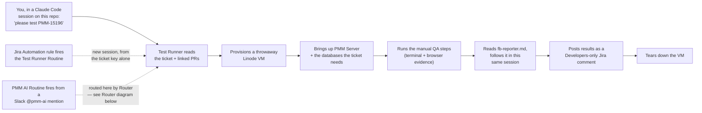
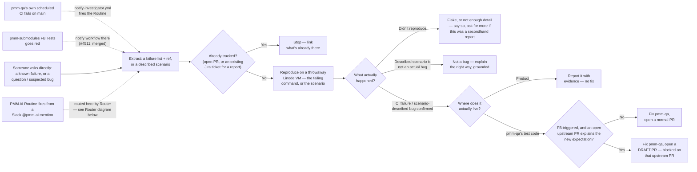
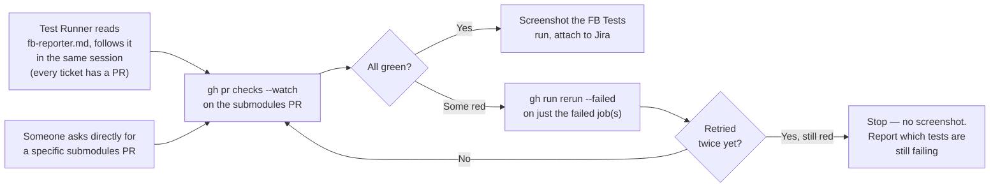
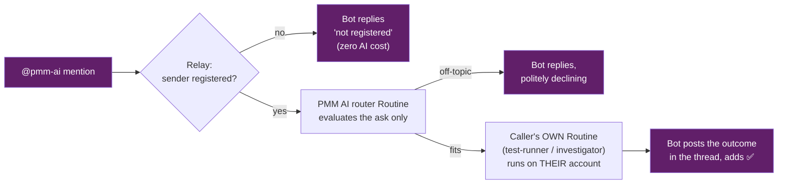
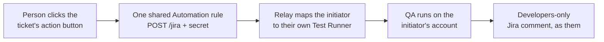

# PMM — Claude Code agents (automations)

Agent behavior lives in `.claude/agents/*.md` and `.claude/skills/*` in this repo — committed, so anyone who opens `percona/pmm-qa` in Claude Code gets all agents automatically. No separate environment snapshot or dashboard config to keep in sync (unlike the earlier Cursor prototype this replaces).

## The five agents

| Agent | Watches / invoked by | Trigger | Does | Never |
|-------|----------------------|---------|------|-------|
| [test-runner](../../.claude/agents/test-runner.md) | A named Jira ticket | Ad hoc — chat, a Jira Automation rule, or a Slack `@pmm-ai` mention routed here by `router` | Reads the ticket, provisions a throwaway Linode VM, runs the manual QA, hands off to `fb-reporter` for the linked submodules PR's evidence, posts a Developers-only Jira comment | Open PRs outside pmm-qa, post public Jira comments |
| [investigator](../../.claude/agents/investigator.md) | **pmm-qa's own** scheduled CI on `main`, `Percona-Lab/pmm-submodules` FB Tests going red, or asked directly (including via `router`) | CI-triggered from both sources (see below), or asked directly | One pipeline (dedup → reproduce → classify) regardless of trigger — classifies **from what actually reproduced**: didn't reproduce, not-a-bug, or a genuine bug that routes to a product-bug report, an ordinary pmm-qa fix+PR, or a blocked draft PR | Fix `percona/pmm`/`percona/grafana`, clone `pmm-submodules`, classify or answer a question without reproducing first |
| [fb-reporter](../../.claude/agents/fb-reporter.md) | Referenced by `test-runner`, or asked directly | N/A — read-and-followed in the caller's own session, or invoked directly | Gets a clean FB Tests screenshot for a ticket's linked submodules PR, retrying past flakiness (`gh run rerun --failed`, up to twice), attaches to Jira | Diagnose or fix a genuine (non-flaky) failure — that's `investigator`'s job |
| [router](../../.claude/agents/router.md) | The `PMM AI` Routine, fired by a Slack `@pmm-ai` mention | Slack-only — see "PMM AI" below | Matches the mention to test-runner / investigator / fb-reporter by description and hands off, or answers directly if it's just a question | Guess a ticket key/PR number that wasn't in the message, do the matched agent's work itself |
| [pr-maintainer](../../.claude/agents/pr-maintainer.md) | Every open `percona/pmm-qa` PR | Scheduled — a daily weekday Routine | Reads each open PR and sorts it into ready / unblocked / needs-review / blocked / needs-work / needs-a-human, maintains a `blocked` label, and posts a **PR Digest** to Slack `#qa-automation` via the relay bot | Merge, close, approve, or edit any PR — the `blocked` label is the only thing it changes |

There's no separate "watcher" agent in front of Investigator. An earlier draft had one (detect the failure, hand off to a shared fixer) — dropped once it became clear the "detect" step was too thin to be its own agent: parsing a trigger payload and extracting a failure list is just Investigator's own first step, not a separable concern the way `fb-reporter`'s screenshot-and-retry job genuinely is.

Why `fb-reporter` (and `router`) isn't spawned as a nested subagent from whatever calls it: whether a Claude Code Remote **Routine**-fired session can itself spawn a custom subagent via the Agent/Task tool isn't confirmed by Claude Code's own docs — `investigator`, `test-runner`, and `PMM AI` all run as Routines, so none of them risk depending on that. Instead, the calling agent's own instructions say to read the target `.md` file directly and follow it in the same session — the same mechanical pattern already used for skills. Each is still a real agent (its own `name`/`description`), so a person in an ordinary interactive session (where subagent-spawning is confirmed to work) can invoke any of them directly, or just ask in natural language.

## Running Test Runner manually

In any Claude Code session on this repo, just ask in natural language — "please test PMM-15196". The agent description matching picks the role; no slash-command prefix required.

## Running Test Runner from Slack

Not Claude Tag (the official Slack app) — it pairs one Slack workspace to one Claude org, and this project's Claude identity isn't the one already paired to the team's workspace. Slack triggering here goes through the custom **`@pmm-ai`** app + relay instead (built — the app awaits admin approval; ops in [`.claude/integrations/slack/README.md`](../../.claude/integrations/slack/README.md)): a **registered** person mentions `@pmm-ai`, the relay fires the central `PMM AI` Routine, which reads [`router.md`](../../.claude/agents/router.md) and only *evaluates and routes* — if the ask fits one of the caller's own routines (e.g. their Test Runner), it hands off through the relay's `/route` endpoint and the work runs **on the caller's own account**; off-topic asks get a short decline, and unregistered users are answered by the relay itself at zero AI cost. A mention never goes straight to Test Runner; it always passes through Router first. See "PMM AI" below for the full picture.

## Running Test Runner from Jira

**Live**: a Jira Automation rule fires an action button on the ticket, sending a plain HTTPS POST to the Test Runner Routine's API trigger whenever a ticket moves to Ready for QA or In QA. The `text` field in that POST isn't limited to a bare ticket key: it's appended as an extra turn on top of the routine's own prompt, so it can carry as much context as you want (summary, priority, whatever Jira smart-values you include).

Not yet per-person: the button fires the one shared Test Runner Routine, so results post under its creator's identity regardless of who clicked it or which ticket it's on. See "Per-person routing in Router" in the go-live checklist below for what closes that gap.

```bash
curl -X POST https://api.anthropic.com/v1/claude_code/routines/<routine_id>/fire \
  -H "Authorization: Bearer <token>" \
  -H "anthropic-version: 2023-06-01" \
  -H "anthropic-beta: experimental-cc-routine-2026-04-01" \
  -H "Content-Type: application/json" \
  -d '{"text": "{{issue.key}}"}'
```

`<routine_id>` and `<token>` come from opening the Test Runner routine in the claude.ai Routines UI and clicking **"Add an API trigger"** — the token is shown once and can't be retrieved again. Configure a Jira Automation "Send web request" action with the above.

### Test Runner flow



A1 is interactive (agent-matching finds Test Runner by description); A2 and A3 both spin up a fresh session from nothing, but only A2 is Test Runner's own Routine firing directly — A3 is Router's Routine firing and then, within that same session, becoming Test Runner. The FB Reporter step is a direct file-read, not a nested subagent spawn — same reasoning as the Router diagram below.

## Investigator — event-triggered from both sources, no polling

`Percona-Lab/pmm-submodules` is also a Percona-owned repo, not a third party's — so unlike an earlier design, there's no need for an hourly polling Routine to catch FB Tests going red. Both of Investigator's sources push an event directly:

- **pmm-qa's own scheduled CI**: [`.github/workflows/notify-investigator.yml`](../../.github/workflows/notify-investigator.yml), already in this repo, fires on `workflow_run` for `e2e-tests-matrix.yml`, `gssapi-psmdb-tests-matrix.yml`, `helm-tests.yml`, `integration-cli-tests.yml` (native GitHub Actions cron), plus `nightly-e2e-tests-matrix.yml` (dispatched daily by the Jenkins pipeline in `jenkins-pipelines`, matched by name since it's not a GitHub cron). It fires on the run's own computed `conclusion`, not any single job's pass/fail — some of these pipelines pass their e2e-test step but fail overall once a later Launchable step errors collecting results, and a hand-maintained per-job list would miss that.
- **`Percona-Lab/pmm-submodules` FB Tests**: a mirroring notify workflow **now lives in that repo** ([#4511](https://github.com/Percona-Lab/pmm-submodules/pull/4511), merged), firing the same Investigator Routine with the submodules PR number + run URL.

Only one secret is needed:

- `INVESTIGATOR_ROUTINE_TOKEN` — the bearer token from the routine's "Add an API trigger" screen. The routine ID itself (`trig_01FhHBdz2yBibyVEfnG5gbQz`) is hardcoded in the watcher file — it isn't sensitive, only the token is.

**Both sides are wired up** — `notify-investigator.yml` is in this repo with `INVESTIGATOR_ROUTINE_TOKEN` set as a repo secret, and the pmm-submodules notify workflow ([#4511](https://github.com/Percona-Lab/pmm-submodules/pull/4511)) is merged.

Investigator also answers a question or a suspected customer-reported bug directly (in chat, or routed from a Slack `@pmm-ai` mention via `router`) — this isn't a separate flow, just a different way into the **same** dedup → reproduce → classify pipeline as a CI/FB event: dedup checks for an existing Jira ticket instead of an open PR (there's no failing test to match against an open-PR marker), and reproduction walks the described scenario instead of re-running a failing command. Classification after that is the same tree either way — didn't reproduce (say so, ask for more detail), described scenario isn't an actual bug (explain the right way, grounded in the reproduction and the code, never a guess — this outcome only applies here, a CI/FB failure that reproduces is never "not a bug"), or a confirmed bug, which then routes to product (report, no fix) or pmm-qa's own test code (fix). See `investigator.md` workflow step 3. This is also why a separate "support-triage" agent, floated earlier for a prod/support Slack channel, was dropped — it would have just duplicated this.

A second Investigator nuance worth calling out: when the FB source is the one that triggered it, a "test bug" fix isn't always a normal, ready-to-merge PR. Submodules tests occasionally get updated *ahead of* the upstream `percona/pmm`/`percona/grafana` PR that will actually introduce the behavior they now expect. Investigator checks for that (an open, not-yet-merged upstream PR touching the same area) before opening a PR — if one exists, it opens the fix as a **draft PR** noting what it's blocked on, instead of a normal one, since merging it before the upstream change lands would just break `main`.

### Investigator flow



No gate asking "was someone waiting for an answer" — that's already implied by which outcome you land on. "Described scenario is not an actual bug" only ever applies when someone described a scenario to check in the first place; a CI/FB failure that reproduces is never that outcome, it's always "confirmed bug." The only real fork is "where does it actually live?" (P) — test vs. product. The draft-PR branch (I → K) only applies when an FB-triggered test bug is anticipating a not-yet-merged upstream PR — merging it early would break `main`.

## FB Reporter — no Routine of its own

No trigger or Routine of its own — it's read-and-followed by `test-runner` (see "why not spawned as a nested subagent" above), or invoked directly by a person. Nothing to wire up here beyond the file itself existing.

### FB Reporter flow



The retry loop caps at 2 total re-checks. Still red after that stops here on purpose — diagnosing or fixing it is Investigator's job, not FB Reporter's.

## PMM AI — custom Slack app + relay (built; app awaiting Slack admin approval)

Claude Tag can't have a second identity in a workspace already paired to
another Claude org, so Slack triggering for this project uses its own small
app, `@pmm-ai`, plus a relay on the `pmm-ai-relay` Linode. Everything is
built and deployed except the Slack app itself, which needs workspace admin
approval — created from
[`.claude/integrations/slack/manifest.yaml`](../../.claude/integrations/slack/manifest.yaml)
(Socket Mode, read-only events + `chat:write`/`reactions:write`; full ops
docs in
[`.claude/integrations/slack/README.md`](../../.claude/integrations/slack/README.md)).

**What the Slack app is and isn't** (the approval-relevant part): it holds no
credentials to anything outside Slack, exposes no public URL (Socket Mode =
outbound-only connection from our server), and can only read messages in
channels it is explicitly invited to, react (👀 received / ✅ done), and
reply in threads. All AI work happens in Claude Code Routines on the
existing QA account(s); the app is just the doorbell and the mailbox.

### PMM AI flow — three entry points, one relay

Purple = the Slack app being requested. Everything else already exists and
works without it.

**1 — `@pmm-ai` mention** (the app delivers the mention and posts the replies):



**2 — watched alerts channel** (future; the app delivers the messages):


**3 — Jira ticket button** (works with no Slack app at all):



The app itself holds no credentials to anything outside Slack, has no public
URL (Socket Mode — outbound connection only), and can only read channels it
is invited to, react 👀/✅, and reply in threads. All routine tokens stay on
the relay server; all AI work runs in Claude Code Routines on the team's own
accounts.

## Routine ownership — read before relying on this

Confirmed from the docs: a Routine's fired session runs under **its creator's personal identity** — commits, PRs, and connector actions (Slack, Jira, GitHub) all appear as that person, using their connectors. There is no service-account or shared-identity option today. If the creator's connector auth lapses or they leave the team, the Routine breaks silently — there's no documented mitigation beyond recreating it under someone else's account. Sharing a session link is also one-way: a teammate can view the latest state, but it does not update live and isn't collaboratively editable — there's no "shared chat everyone works in together" mechanism.

## Linode cost-safety net

Test Runner and Investigator both provision a throwaway Linode VM per run (`terraform/linode-runner/`, see [linode-docker-provisioning](../../.claude/skills/linode-docker-provisioning/SKILL.md)) — FB Reporter never does, it only calls `gh`/Jira. Primary cleanup is the agent calling `down.sh` as its last step, on every exit path. The backstop is **not** a scheduled Routine — every instance carries its own on-box self-destruct timer (default 24h, see `terraform/linode-runner/README.md`) that deletes it via the Linode API with no external process involved. `extend.sh` pushes that timer back if a run needs more time.

**HA runs are the exception with no backstop.** When a change is HA-impacted, Test Runner (or Investigator reproducing an HA failure) also stands up a Linode LKE Kubernetes cluster via [linode-ha-provisioning](../../.claude/skills/linode-ha-provisioning/SKILL.md) — a multi-node cluster plus a LoadBalancer, billed by the hour. That cluster has **no on-box self-destruct timer** (there's no box to run one), so its only cleanup is the agent calling the skill's `destroy-lke.sh` on every exit path. Whether HA is even in scope is decided up front from the ticket and the diff by the [test-scope](../../.claude/skills/test-scope/SKILL.md) skill (its `references/ha.md` holds the criteria); most changes aren't HA-impacted and never create a cluster.

## PR Maintainer — daily PR digest

A scheduled weekday Routine reads [`.claude/agents/pr-maintainer.md`](../../.claude/agents/pr-maintainer.md) and triages **every open `percona/pmm-qa` PR**, then posts one **PR Digest** to Slack `#qa-automation`. It is **read-only** — it never merges, closes, approves, or edits; it tells humans what's actionable.

It **reads** each PR (not a keyword scan) and sorts it (first match wins; bias to "needs a human"): 🔓 **Unblocked** (carries the `blocked` label but the reason has now cleared → promote/re-verify; the agent removes the label), ⏳ **Blocked** (the agent *judges* the PR can't safely merge yet — most often waiting on another PR to land — and adds a `blocked` label), 🔧 **Needs work** (open review threads — whoever opened them — or changes requested), ✅ **Ready to merge** (approved, no open threads, not blocked), 👀 **Needs review** (waiting on a reviewer), and ❓ **Needs a human** (nothing fits cleanly). **CI checks are deliberately ignored** — an approved PR is ready regardless. The `blocked` label (add/remove) is the only thing it ever writes; it never merges, closes, approves, or edits.

Delivery reuses the **relay bot**, so no MCP connector is needed in the Routine (which sidesteps the connector-in-routine limits): the run `curl`s the composed digest to the relay's `POST /slack/announce` (gated by `RELAY_KEY` + the caller's `X-Actor` login), which posts it as the `@pmm-ai` bot to a channel it's been invited to. Daily, weekdays, **no @-mentions**.

## Secrets architecture — relay-brokered (built; prod cutover pending)

> **Status (2026-08-12):** the broker (`/<service>/<action>`) is implemented and **validated end-to-end on a staging relay**: `/linode/provision` → `{ip, exec_token, exec_cert_pem}`; `/linode/destroy` → `ok` (works with the events-read Linode token); `/jira/read` → the ticket; and the identity gate rejects a missing `X-Actor` (401), a non-roster actor (403), and a wrong `RELAY_KEY` (403). Identity is a single mechanism (`X-Actor`, roster from the people files — no extra env vars). Remaining human step: prod cutover — an admin sets `RELAY_KEY` in the qa-linode shared env (Davi can't set shared-env vars), then a session deploys the current relay code, then `LINODE_TOKEN`/`JIRA_*` come off the shared env.

**Problem.** The shared qa-linode environment stores `LINODE_TOKEN` and `JIRA_TOKEN` in plaintext — visible to everyone in it, flaggable by a secret scanner, and reusable by a prompt-injected run. Worse, that `LINODE_TOKEN` is enough to *rebuild* the relay via the Linode API (deploy is an API rebuild, not SSH — the relay has no SSH key and no exec-server), i.e. fully compromise it. So the relay is only a real vault once the token is out of the shared env.

**Target.** Provider tokens live **only on the relay** (behind root, in its `.env`, put there by a human deploy sourcing from LastPass — never in the shared env, never in a routine). The shared env holds a single **`RELAY_KEY`** — not a provider token, just a bearer for the relay's own API. Every privileged action is a **narrow, audited** endpoint under one consistent scheme: **`POST /<service>/<action>`**.

- **`/linode/provision`** + **`/linode/destroy`** — create/destroy the standard throwaway VM (+ its firewall); provision returns the per-run `{ip, exec_token, exec_cert_pem}` so `run.sh` reaches the box without the account token. The relay runs terraform with `LINODE_TOKEN` on-box.
- **`/jira/<action>`** — the **full** set of Jira ops, scoped to the PMM project, forcing Developers-only comment visibility server-side: `read`, `comment`, `field` (`customfield_10492` etc.), `transitions`, `transition`, `attach`. No create, no delete.
- **`/slack/<action>`** — `announce` (fresh channel post, e.g. the PR digest), `post` (in-thread reply), `history` (read a thread). Slack-token-gated; degraded to log lines until the Slack app is live.
- **Plumbing (unchanged, separate auth):** `/health`; `/reply` + `/route` (HMAC capabilities for the mention→routine→reply flow); `/jira` (the Jira-Automation *trigger* that fires a routine — exact path, no collision with `/jira/<action>`).

One dispatch, one gate: consolidating the old `/announce`, `/jira-act`, `/provision`, `/destroy` into `/<service>/<action>` removed the per-endpoint boilerplate and made the auth uniform. Interactive sessions and routines use the **same `RELAY_KEY`**.

**Identity — one mechanism, all flows.** Every broker call sends `X-Actor` (the caller's GitHub login, from `gh api user`, which the egress proxy really verifies) and the relay checks it against the roster — the `github` logins in the people files it already loads — and records it. No extra env var; the roster *is* the people directory. This behaves identically in autonomous Routines and interactive sessions (unlike token-verification, which can't work from the proxied Routines — see "Why `X-Actor` and not token-verification").

**Why `X-Actor` and not token-verification.** A Claude Code session's GitHub token is a *proxy-brokered placeholder* (`prox…`) that only authenticates *through* the egress proxy; a standalone relay calling GitHub `/user` with it gets `github_auth_failed`, and write-based proofs (gists, ref-deletes) are blocked by the proxy. So the relay can't independently verify a token or make the caller create a GitHub-owned artifact cheaply. `X-Actor` is the one thing that works the same in every flow.

**Threat model — what an attacker needs, and the blast radius.** The hard gate is possession of `RELAY_KEY`, which lives **only** in the shared qa-linode env and the relay's root `.env` — never printed, committed, or logged. To use the broker an attacker must **either** already be a member of that admin-controlled env, **or** exfiltrate `RELAY_KEY` (e.g. a prompt-injection that both reads the env var *and* smuggles it out past the restricted egress proxy — a high bar), and then also assert a real roster login (public GitHub handles). Even with all that, the reward is bounded: the whole surface is provision/destroy a throwaway QA (VM or LKE) environment, a Developers-only Jira comment / field / transition on an *existing* PMM ticket, **creating an issue in the `PMM` project** (project forced; no delete), or a Slack post — each audited by `X-Actor`. The provider tokens are never exposed, so there is **no path to the Linode or Jira account, no data theft, no persistence, no way to rebuild the relay.** `X-Actor` is forgeable by someone who already holds `RELAY_KEY`, so it is an audit-and-roster control, not a cryptographic one — an accepted trade given the bounded, reversible blast radius. The unspoofable upgrade if ever needed is the **push-proof** (caller force-pushes a relay-issued challenge to a single per-user ref `pmm-ai-id/<login>` — `git push` works through the proxy and is attributed to the real GitHub user; the relay reads the real pusher and issues a session token). Designed, not built.

**Coverage — verified against the current code:**
- **Linode: fully covered by `/linode/provision` + `/linode/destroy`.** `LINODE_TOKEN` is used *only* by `up.sh` (create) and `down.sh` (destroy); `run.sh`, `extend.sh`, `sync.sh` have **zero** `LINODE_TOKEN` refs and drive the VM through the per-run `exec_token` that provision returns. So `run.sh` needs that `exec_token`, never the account token.
  - **Token scope.** The terraform Linode provider polls `/v4/account/events` to confirm create/delete, so the relay's `LINODE_TOKEN` needs **Linodes + Firewalls read/write AND Events read-only** (`down.sh` 401s without events:read). Standard provider behaviour — no terraform workaround.
  - **Keep-alive is preserved.** "Provision and leave it up for me" still works: provision takes `ttl_hours` (default 24h; any window honored — no fixed cap), the agent skips destroy, and the on-box self-destruct timer still cleans up. `extend.sh` pushes that timer back via the `exec_token`, no `LINODE_TOKEN` involved.
  - **The `SessionEnd` cleanup hook is rewired (done).** `session-end-cleanup.sh` now POSTs `/linode/destroy` (with `RELAY_KEY` + `X-Actor`) for relay-brokered runs, keeps the legacy `down.sh` path for local state, and **skips any run with a `keep-alive` marker**. It stays in `settings.json`; only its teardown call changed. The on-box self-destruct timer remains the actual guarantee.
  - **HA/LKE covered by `/linode/provision-lke` + `/linode/destroy-lke`.** The `linode-ha-provisioning` skill stands up a throwaway LKE (Kubernetes) cluster with PMM in HA mode via Helm — no single Docker VM, so no on-box self-destruct timer. The two new endpoints mirror the VM ones (same `RELAY_KEY` + `X-Actor` gate; the relay runs `create-lke-pmm-ha.sh`/`destroy-lke.sh` with its own token and returns `{cluster_id, external_ip, url, kubeconfig_b64, passwords}`). Because there is no box to run a timer, the guarantee is a **relay-side TTL reaper**: at create the cluster is tagged `expires-<epoch>` (default 24h; `ttl_hours` overrides for keep-alive), and a `setInterval` in `relay.js` lists LKE clusters straight from the Linode API and deletes any `pmm-qa-ephemeral` cluster past its expiry (untagged/half-created ones fall back to `created + LKE_HARD_MAX_TTL_H`). Stateless and tag-based, so it survives relay restarts and lost run state — the LKE equivalent of the VM's on-box timer. The `SessionEnd` hook fires `/linode/destroy-lke` for any run carrying an `lke` marker (fast path); the reaper is the backstop. **Token scope:** these need **LKE (Kubernetes) read/write** on the relay's `LINODE_TOKEN` — **already present** (verified 2026-08-13: cluster create+delete and the reaper's list all returned 200). **Deploy:** `deploy.sh` now installs `linode-cli`/`kubectl`/`helm`/`jq` on the relay box; the endpoints + reaper only need a relay **redeploy** to go live (the same redeploy as the `RELAY_KEY` cutover). **Validated 2026-08-13** on a throwaway `pmm-ai-relay-test` box (main untouched): auth/validation gates on `provision-lke`/`destroy-lke`, and the reaper deleted an expired `pmm-qa-ephemeral` cluster end-to-end.
- **Jira: fully covered by `/jira/<action>`.** create + read + comment (Developers-only, forced) + field + transitions + transition + attach — the whole set the `jira` skill uses. **`create`** files a new issue with the project **forced to `PMM`** (Investigator uses it to file auto-detected product bugs; the relay defaults **Found by Automation** `customfield_10059` = Yes on the Bugs it creates). Only **delete** is refused by construction.
- **Slack: covered** — `/slack/announce` (proactive posts), `/slack/post` (thread reply), `/slack/history` (read); the mention→routine→reply flow keeps its HMAC-capability `/reply`.

**Why it's safe.** The tokens can't be stolen or scanned (never in the env); actions are bounded by the endpoints, not by the model's judgement; a leaked `RELAY_KEY` grants only those bounded ops, never account access. Residual: rebuilding the relay is an intentional insider action on the shared Linode account — accepted within the team.

**Migration rule — do not lose capability.** Before a token leaves the env, its relay endpoint(s) must cover **every** operation the agents perform today — Jira: read, comment (Developers-only), edit fields, transition, attach; Linode: provision, exec (`run.sh`), extend, sync, destroy. A narrow endpoint that only posts a comment would strand the rest, so each token's migration waits behind full coverage. (Shareable one-pager: the "Secrets on the Relay" artifact.)

## Go-live checklist — remaining steps (1 step = 1 box)

**Relay broker — move secrets off the shared env:**

- [x] Consolidated the broker to one `POST /<service>/<action>` dispatch (`/linode`, `/jira`, `/slack`), replacing `/announce`, `/jira-act`, `/provision`, `/destroy` (2026-08-12)
- [x] `/linode/provision` → `{ip, exec_token, exec_cert_pem}`, `/linode/destroy`, `/jira/read` validated end-to-end on a staging relay; identity gate rejects no-`X-Actor` (401), non-roster actor (403), wrong `RELAY_KEY` (403) (2026-08-12)
- [x] `LINODE_TOKEN` scoped to Linodes + Firewalls R/W **+ Events read-only** so `down.sh`/`/linode/destroy` works (the provider polls `/account/events`) (2026-08-12)
- [x] `SessionEnd` hook rewired to `/linode/destroy` + keep-alive skip; `jira`/`linode-docker-provisioning` skills and `pr-maintainer` call the new endpoints with `X-Actor` (2026-08-12)
- [x] Identity settled on a single `X-Actor` mechanism, roster read from the people files — no `RELAY_GH_ALLOW`/`RELAY_IDENTITY_MODE` env vars (2026-08-12)
- [x] **Delete the stray `pmm-ai-id/test-6c3651be` branch** on `percona/pmm-qa` — done by Davi 2026-08-12 (proxy blocked ref-delete from a session)
- [x] **Add each teammate's `github` login** to their `people/<name>.json` (the broker roster) — all 23 finalized and stored in LastPass 2026-08-12
- [x] **Finalized relay `.env`** (identity-gated broker + `RELAY_KEY`) stored in the LastPass **PMM** note 2026-08-12
- [x] **`RELAY_KEY` set in the qa-linode shared environment** by an admin, and the current relay code deployed to `pmm-ai-relay` (`139.162.176.43`) — sessions can now authenticate to the broker (2026-08-17).
- [x] **`LINODE_TOKEN` and `JIRA_*` removed from the shared env** by an admin — the relay broker is the only holder now (2026-08-17).

**Launch core (Jira button → Test Runner):**

- [x] ~~Before merging #1143 — hand-fix its `.claude/settings.json` linode-runner rules~~ — superseded: we since learned the real gate in Routine runs is the auto-mode classifier + multi-repo settings loading (see the classifier finding below), not those allow rules.
- [x] Merge [PR #1143](https://github.com/percona/pmm-qa/pull/1143) — merged 2026-08-10
- [x] After merge: made a trivial edit to the qa-linode environment's setup script — forced the settings cache to rebuild now instead of waiting ~7 days (done 2026-08-10)
- [x] [Percona-Lab/pmm-submodules#4511](https://github.com/Percona-Lab/pmm-submodules/pull/4511) merged — FB Tests red now fires Investigator

**Slack app + relay (in order):**

- [x] Reserved the relay's public IP `139.162.176.43` (Frankfurt, tag `pmm-ai`) 2026-08-08 — survives delete/rebuild, so the hostname + Let's Encrypt cert stay valid and the endpoint can't be reassigned to a stranger
- [x] **Jira service account from IT** — done (2026-08-11): a dedicated "PMM QA Bot" account with only the PMM-project permissions the REST fallback needs (read issues, add Developers-restricted comments, add attachments, edit fields, transition); its `JIRA_EMAIL`/`JIRA_API_TOKEN` are set in the environment. This was blocking for team rollout — env vars are shared across everyone in the environment, so without a service account every bot comment would post as *one real person's* identity (whoever's token is set) and per-person onboarding couldn't give each teammate their own Jira identity. The service account keeps QA comments neutral and decoupled from any individual.
- [x] Restricted Linode PAT (Linodes + Firewalls R/W) set as `LINODE_TOKEN` (done)
- [x] **`LINODE_TOKEN` delete-path 401** — the provider's instance-delete lists `/v4/account/events`, which 401s a token without `events:read`. Fixed by granting the token **Events read-only** (alongside Linodes + Firewalls R/W) — standard provider requirement, kept over a terraform workaround (2026-08-12).
- [ ] **GitHub App Actions scope** — grant the GitHub App installation on `percona/*` **Actions: Read and write** (`rerun-failed-jobs` answers `X-Accepted-Github-Permissions: actions=write`), hit live on 2026-08-12 in [run 31549464587](https://github.com/percona/pmm-qa/actions/runs/31549464587). **Owner:** a `percona` GitHub org owner/admin (IT) — org-app installation permissions can only be changed by an org owner at `github.com/organizations/percona/settings/installations`.
- [x] Relay infrastructure verified end-to-end 2026-08-07 (Linode up, Let's Encrypt cert trusted through the session egress proxy, /health 200, /reply and /jira auth gates 403, davi.json loaded, crash-on-bad-token fixed)
- [x] Create the Slack app from `manifest.yaml` (done 2026-08-08)
- [ ] Get Slack admin approval + install the `@pmm-ai` app.
- [ ] Generate the App-Level Token (`xapp-`, scope `connections:write`).
- [ ] Copy the Bot Token (`xoxb-`).
- [x] Generate the PMM AI routine's API token (done 2026-08-07, stored in the LastPass **PMM** note)
- [x] Get the Test Runner routine's token (done 2026-08-07, stored in the LastPass **PMM** note)
- [ ] Hand a session the 2 Slack tokens + routine tokens (from LastPass) to finish the relay `.env` and start it.
- [ ] Save the completed `.env` to the LastPass **PMM** note.
- [ ] `/invite @pmm-ai` to a channel and confirm 👀 → reply.
- [ ] Point the Jira button automation at the relay's `POST /jira` (header `X-Relay-Secret`, body `accountId`+`text`, "Wait for response" on).
- [ ] Add a `{{webResponse.status}} == 404` → "not onboarded" comment to that rule.
- [ ] Click the Jira button on a test ticket and confirm it runs.

**Jenkins access (staging builds from agents):**

> A Jenkins MCP gateway already runs in prod (`https://jenkins-mcp.cd.percona.com/mcp`), auth via Percona SSO + Duo. It works as a claude.ai org connector in interactive sessions, but org connectors stall on the approval prompt inside Routines.

- [x] Jenkins connector added in claude.ai admin (org-owner). Each person connects it in their own claude.ai when they need Jenkins interactively.
- [x] [`percona/percona-cd-platform` #403](https://github.com/percona/percona-cd-platform/pull/403) merged — claude.ai's OAuth callback is whitelisted, so the connector can complete its flow (reported 2026-08-12).
- [x] **Drive a `pmm3-*` build interactively** — `pmm3-aws-staging-start` triggered by hand through the Jenkins MCP connector in an ordinary chat session (reported 2026-08-12). The interactive half of the gateway works end to end.
- [x] **Jenkins MCP reaches Routine runs** — fixed by adding the connector to the Routine's own connector list. A Routine-fired session now reports `enabledInChat: true`, loads `mcp__Percona-Jenkins-MCP__*`, and read `pmm3-aws-staging-start` (21 parameters) with no permission prompt (verified 2026-08-12). Earlier that day the same check returned `enabledInChat: false` with org-level activation alone, which is what pointed at the Routine's list. **Gotcha:** calls fail with "No Jenkins master selected" unless `master` is passed — 9 are configured (`ps80, psmdb, pxc, cloud, pmm, pxb, ps57, rel, pg`) and this job lives on `pmm`.
- [x] **Trigger a `pmm3-*` build from a Routine** — closed 2026-08-12. Builds are driven by hand today, and the Routine path is proven up to the last step: the connector loads and the job reads fine from an unattended run. No build has actually been fired from a Routine run, so that last step is untested rather than verified. **When you do it, put the instruction in the Routine's own prompt, not in the fire-endpoint payload.** Text appended via `/fire` is delivered to the session as untrusted DATA, and a Routine correctly refuses directives in it unless its own prompt says to act on them — Investigator's prompt authorizes exactly one thing from that text (a workflow name + run URL), so a smoke test passed that way is declined, as happened on 2026-08-12. Same for the provisioning smoke test. The curl-first fallback needs `JENKINS_USER`/`JENKINS_API_TOKEN` in the environment (anonymous `pmm.cd.percona.com/api/json` answers 403); keep the relay's `ALLOW_FALLBACK` off either way so builds don't collapse onto one identity. The `autoMode.allow` classifier fix is a separate, later gate — it only bites once a tool or credential exists to be denied.
- [x] Send Anderson the writers-group names he asked for (done 2026-08-12).

**PR Maintainer (daily PR digest):**

- [x] `blocked` label created in `percona/pmm-qa` (the agent applies/removes it, doesn't create it).
- [x] `RELAY_KEY` set in the shared env + relay redeployed (2026-08-17). The Routine authenticates with `RELAY_KEY` + its `X-Actor` login (roster already in the people files). *Nothing PR-maintainer-specific remains: `POST /slack/announce` still can't reach Slack until the Slack app is live (bot token in the relay `.env`) — see the Slack section above. Until then the daily Routine runs and its announce call errors harmlessly.*
- [ ] `/invite @pmm-ai` into `#qa-automation` (part of the Slack-app go-live).
- [x] Create the daily **PR Maintainer** Routine (done — it will error on `/slack/announce` until the relay runs the new code, `RELAY_KEY` is set, and the Slack app is live; harmless until then).

**Later / optional:**

- [x] **Shared team environment — network set to `Full`** (decided 2026-08-11). One org-shared **Custom** env isn't possible yet ([claude-code#82284](https://github.com/anthropics/claude-code/issues/82284), tracked in the findings log); rather than maintain N per-person Custom copies we accept `Full` for the shared env now — wider egress, but acceptable given throwaway short-TTL VMs + least-privilege service credentials. Every teammate's Routine points at this one env.
  - **Env vars (all plaintext-visible to env users → use least-privilege service credentials)**: `LINODE_TOKEN` (VM provisioning), `JIRA_EMAIL` + `JIRA_API_TOKEN`, set once at the environment level.
  - **Setup script**: the `/root/.claude/settings.json` bootstrap (hooks + permissions for multi-repo sessions).
  - **Identity note**: per-person GitHub identity works (each person's own routine). Jira posts, however, all use the shared `JIRA_API_TOKEN` = one identity, until connector bug #61015 is fixed and Jira can move back to the per-person connector.
  - **When #82284 is fixed**: tighten this env from `Full` to **Custom** with the allowlist (`perconadev.atlassian.net`, `api.linode.com`, `*.nip.io`, `registry.terraform.io`, relay host `139-162-176-43.ip.linodeusercontent.com`, + "Also include default list"). The `linode-docker-provisioning` skill checks the issue on each run and flags this automatically.
- [ ] (optional) Map an alerts channel to Investigator via `CHANNEL_ROUTINES` in the relay `.env`

## Findings log (reference — done items and long-form context)

- [x] `LINODE_TOKEN` available to sessions that need it — **no real secrets store exists yet** in the environment config; anything set there is plaintext-visible to every teammate with access to that environment. Use a least-privilege, access-controlled Linode API token (scoped to Linode/Firewall create-delete only, not full account access) rather than a personal full-access token — and note it still flows into `TF_VAR_linode_token`, gets templated into each instance's cloud-init `user_data`, and is persisted in that run's local `terraform.tfstate`; this is an accepted tradeoff of the current design (throwaway VMs, short TTL, no shared state backend), not an oversight, but it's why the token's scope matters more than usual here.
- [x] **Jira connector broken in Routine runs — workaround complete** ([claude-code#61015](https://github.com/anthropics/claude-code/issues/61015): approval demanded despite the connector being attached; closed upstream but still reproduced 2026-08-06 on PMM-15188). The `jira` skill is **curl-first** (REST, no approval gate); `JIRA_EMAIL` + `JIRA_API_TOKEN` added to the qa-linode environment 2026-08-06. Both connector rule spellings kept duplicated in settings.json so whichever the platform honors post-fix is already covered.
- [x] **Org-shared environments can't be Custom — decided: `Full` for now, recheck automated in the `linode-docker-provisioning` skill** ([claude-code#82284](https://github.com/anthropics/claude-code/issues/82284), still **open** upstream: shared/org cloud environments expose only Trusted/Full, no Custom/Allowed-domains, contrary to the documented field parity). We can't ship **one** org-shared Custom environment carrying our allowlist (`perconadev.atlassian.net`, `api.linode.com`, `*.nip.io`, `registry.terraform.io`, relay host). **Decision 2026-08-11**: use a shared `Full` env now rather than maintain N per-person Custom copies — wider egress, accepted given throwaway short-TTL VMs + least-privilege service credentials. **Recheck is now automated** — the `linode-docker-provisioning` skill checks whether #82284 is resolved on each provisioning run and, if it is, tells the user to move the shared env from `Full` to Custom with the allowlist above (admin flips it at claude.ai/admin-settings). No manual periodic recheck needed.
- [x] GitHub connector activated for the org
- [x] `gh --version`, `terraform version`, `json-diff --version`, `ffmpeg -version` succeed after a fresh SessionStart hook run
- [x] Connector permission prompts — understood, not repo-fixable: in web sessions the prompt is **enforced by the claude.ai host layer** — no `permissions.allow` spelling and no PreToolUse allow-hook can suppress it (all tested live 2026-08-06). Routine runs are governed by the Routine's own connector list instead (once #61015 is fixed). Consequently settings.json allowlists only `mcp__github`, the one MCP entry that verifiably works (project-provisioned server). Useful facts: settings/hook edits hot-reload mid-session; connector server names vary across sessions (`Atlassian_Rovo` vs `Atlassian-Rovo`); an agent cannot see whether a prompt fired — verification needs a human watching.
- [ ] **Provisioning is blocked in Routine runs by the auto-mode classifier — needs the `autoMode` block committed to `.claude/settings.json`.** **Decision (2026-08-17): use the repo→user-scope path, NOT org/managed settings.** The block goes into this repo's `.claude/settings.json`; the qa-linode setup script already copies that file to `/root/.claude/settings.json` (user scope, see line ~350), which is where the classifier reads it — so merging the block resolves this with no org-settings change. **Applied 2026-08-17:** the block is now committed to `.claude/settings.json` in this PR (with Davi's explicit authorization for this one edit; the 5 obsolete `Bash(*linode-runner/*.sh *)` allow rules were dropped at the same time). It resolves once this merges to `main` **and** the setup script is `touch`ed to bust its ~7-day cache. The block that was added is below. Hit live 2026-08-10 and again 2026-08-14 ([run 31765312223](https://github.com/percona/pmm-qa/actions/runs/31765312223)): Investigator got through dedup, then every attempt to reach the provisioning relay was denied with `Blocked by classifier`. A Routine cannot show a permission prompt, so the run just continued and closed with no verdict. Mechanics — the earlier notes here were partly wrong; **corrected against the official docs 2026-08-14** ([auto-mode-config](https://code.claude.com/docs/en/auto-mode-config), [permissions](https://code.claude.com/docs/en/permissions), [server-managed-settings](https://code.claude.com/docs/en/server-managed-settings)):
  - **The lever is `autoMode`, not `permissions.allow`.** Auto mode routes every tool call through a classifier that blocks anything aimed *outside the trusted environment*. The denial is **destination-based**: a plain `GET /health` to the relay host is denied while `curl https://api.github.com/rate_limit` (a repo remote) returns 200. In auto mode, **broad `permissions.allow` entries — a bare `"Bash"`, `Bash(*)` — are suspended** (the classifier evaluates the command regardless); only *narrow* rules (`Bash(npm test)`) carry over and resolve before it. So no `permissions.allow` spelling fixes this — `autoMode.environment` (trusting the relay's provider domain) is the primary lever, and `autoMode.allow` clears the "creating billable/irreversible infra" soft block.
  - **The classifier reads `autoMode` only from user scope (`~/.claude/settings.json`) and [managed settings](https://code.claude.com/docs/en/server-managed-settings) — NOT from project `.claude/settings.json`.** A block committed to this repo's `.claude/settings.json` is therefore inert *as project settings*; it takes effect **only because the qa-linode setup script copies that file to `/root/.claude/settings.json` (user scope)**. The durable, org-wide home is **server-managed settings** — an org Owner pastes it at `claude.ai/admin-settings/claude-code`; it is the only managed channel that reaches cloud/web sessions and it is highest precedence. The repo→user-scope copy is the self-service fallback that lands via PR today (then touch the setup script to bust its ~7-day snapshot cache). If it goes to managed settings it applies org-wide, so every `environment` line is written to be true for all of Percona, not scoped to QA.
  - **Correction to the earlier claim:** `Bash(...)` rules are **globs, not prefix-only**, and a **leading `*` does match** — the docs give `Bash(* install)` matching any command ending in a space followed by `install` ([permissions § Wildcard patterns](https://code.claude.com/docs/en/permissions)). The old note that `Bash(*linode-runner/up.sh *)` "leads with `*`, but Bash rules are prefix matches" was wrong on the semantics. (It was separately true that those entries were absent from the `settings.json` planted from `main` at the time.)
  - **Provisioning moved to the relay (#1163):** `up.sh`/`down.sh` run on the relay now, so the session-side action is a `curl` to the relay, not a local `terraform apply`. The five `Bash(*linode-runner/*.sh *)` entries are obsolete — **remove them**; `run.sh`/`sync.sh`/`extend.sh` (still session-side, reaching `exec-<ip>.nip.io`) are covered by the `autoMode` block below (the `exec-*.nip.io` trust + the provisioning/driving `allow` entry). Keep the other bare tool-name / `mcp__*` allows — those are permission-layer grants, a separate gate the classifier doesn't touch.
  - **An agent cannot apply the `settings.json` change itself** — editing `.claude/settings.json` is a self-escalation boundary (an agent granting itself provisioning rights). A human commits it, or an Owner pastes the `autoMode` block into managed settings.

  The `autoMode` block to add (keep every `"$defaults"` — it splices in the built-in rules; omitting it discards them. `soft_deny`/`hard_deny` are deliberately left unset so their built-ins stay intact):

  ```json
  {
    "autoMode": {
      "environment": [
        "$defaults",
        "Organization: Percona, an open-source database software company (github.com/percona and github.com/Percona-Lab). Primary use of Claude Code: software engineering across many teams and repositories. Some sessions additionally stand up and tear down throwaway test infrastructure for QA and CI; that is one workflow among many, not the primary use.",
        "Source control: the Percona GitHub organizations github.com/percona and github.com/Percona-Lab, and every repository under them — two GitHub orgs but a single trust domain (one company). A repository not attached to a session was simply not selected at creation (cross-org repos can't be attached mid-session), not foreign. Percona has many more repositories than any one session touches.",
        "Repository visibility: mixed across Percona — most repositories are public, some are private.",
        "Cloud provider(s): Linode (Akamai). Used to create short-lived, self-destructing test instances and throwaway Kubernetes (LKE) clusters for QA and CI, through the Linode API at api.linode.com.",
        "Trusted internal domains: *.linodeusercontent.com and *.ip.linodeusercontent.com — the automation relay and throwaway-cluster load balancers are reached at Linode reverse-DNS hostnames of the form <ip-with-dashes>.ip.linodeusercontent.com, whose address changes on every rebuild (sometimes daily), so the provider domain is trusted by wildcard rather than any fixed host. exec-*.nip.io — a throwaway instance's own exec service is reached at exec-<instance-ip>.nip.io, derived from that instance's IP and not knowable in advance; only the exec-prefixed host is trusted, not arbitrary nip.io names that map to any public IP. perconadev.atlassian.net — Percona's Jira. *.cd.percona.com — Percona's Jenkins CI.",
        "Key internal services these sessions talk to: an automation relay that brokers infrastructure and ticketing actions (Linode VM and LKE provisioning/teardown, Jira, chat notifications) at a *.ip.linodeusercontent.com host whose address is not fixed; Percona Jenkins at pmm.cd.percona.com (and *.cd.percona.com); Percona Jira at perconadev.atlassian.net; Launchable at *.launchableinc.com; the Linode API at api.linode.com; the Terraform registry at registry.terraform.io; and Percona's public Docker Hub namespaces docker.io/percona and docker.io/perconalab.",
        "Additional context: many of these are cloud (web) sessions that root at a parent directory above several cloned repositories, so the classifier's working-repo default may not resolve to a Percona repo — the Source control entry above states the trust domain explicitly. The test infrastructure these sessions create is single-run and self-destructing (Linode VMs carry an on-box TTL timer; throwaway LKE clusters carry an expiry tag a reaper enforces), so standing one up and destroying it are the ordinary first and last steps of a task, not unusual or irreversible side effects."
      ],
      "allow": [
        "$defaults",
        "Provisioning, driving and tearing down single-run, self-destructing test infrastructure is expected routine work here, not an unusual or unintended side effect. This covers: creating a throwaway Linode VM or a throwaway Linode Kubernetes (LKE) cluster to reproduce a failure or run a test; POSTing provision and teardown requests to the automation relay; running the session-side helper scripts that drive an already-provisioned instance over its exec service at exec-<ip>.nip.io; and any of the above led by environment-variable assignments such as PMM_QA_REF=, DOCKER_VERSION= or CLIENT_VERSION=. Narrowing a run's inbound exposure with ALLOWED_INBOUND_CIDR=<caller-ip>/32 is likewise routine; opening it to the whole internet (0.0.0.0/0) is a deliberate, visible choice made at the call site, not a widening this entry pre-approves. These instances self-destruct on their own (on-box TTL timer / expiry-tag reaper); standing one up is the normal first step of a reproduction and destroying it is the mandatory last step."
      ]
    }
  }
  ```

  Verify after applying: `claude auto-mode config` confirms the entries loaded with `"$defaults"` expanded (validated 2026-08-14 in an isolated `CLAUDE_CONFIG_DIR` — the block parses and merges, `soft_deny`/`hard_deny` stay at their defaults); `claude auto-mode critique` gives an AI review of the custom prose. Functional check: `curl -sS https://<relay-host>/health` returns 200 instead of `Blocked by classifier`, or fire Investigator and confirm it reaches provisioning. Deliberately **not** recommended: `defaultMode: bypassPermissions`, `disableAutoMode`, or `autoMode.classifyAllShell` — the first two switch off the thing that would stop a genuinely bad command in an unattended run.
- [x] `INVESTIGATOR_ROUTINE_TOKEN` added as a repo secret so `notify-investigator.yml` can actually fire
- [x] Live Claude Code Remote Routines updated to match this architecture (Test Doctor renamed to Investigator, FB Validator handled) — see "Updating the live Routines" below for what changed
- [x] **Cross-org access to `Percona-Lab/*` — solved: attach the repo at session/Routine creation** (multi-repo, verified live 2026-08-06: `gh api` on both repos and `gh run rerun <id> --failed -R Percona-Lab/pmm-submodules` all work). Single-repo sessions stay blocked by design: mid-session `add_repo` is refused cross-tier, and a PAT env var can never widen scope (the proxy swaps credentials and enforces scope itself). Fallbacks in an unattached session: anonymous git read, or data passed in via the trigger payload. Details for agents live in the `repos` skill.
- [x] **Multi-repo sessions load no project settings** — they root at `/home/user` (the *parent* of the clones, `$CLAUDE_PROJECT_DIR` unset), so `settings.json` (hooks + permissions) loads from nowhere, though `CLAUDE.md`/agents/skills still load. **Fixed and verified end-to-end 2026-08-06**: the environment setup script below plants the committed settings at user scope (`/root/.claude/settings.json`), which cloud sessions honor — SessionStart tooling, clone guard, and allowlist all active in a fresh multi-repo session with zero prompts. **Applied to the qa-linode environment 2026-08-06.** Caveats: setup-script results are snapshot-cached ~7 days (touch the script to force a rebuild after settings changes on main); the allowlist applies to every session in that environment. Environment setup script (web-UI-only config; this snippet is the record):

  ```bash
  # pmm-qa: plant hooks+permissions as user-scope settings so they load in
  # multi-repo sessions (which root at /home/user, loading no project settings)
  mkdir -p /root/.claude
  if [ -f /home/user/pmm-qa/.claude/settings.json ]; then
    cp /home/user/pmm-qa/.claude/settings.json /root/.claude/settings.json
  else
    curl -fsSL --max-time 30 \
      https://raw.githubusercontent.com/percona/pmm-qa/main/.claude/settings.json \
      -o /root/.claude/settings.json || echo "WARN: pmm-qa settings fetch failed" >&2
  fi
  exit 0
  ```

- [x] Repos added to Routine repository lists 2026-08-06: `pmm-qa`, `pmm`, `grafana`, `Percona-Lab/pmm-submodules`, `Percona-Lab/jenkins-pipelines` on both live Routines (Test Runner, Investigator) — enables cross-org `gh api`/CI re-runs in their runs. Note: these runs are now multi-repo sessions (root at `/home/user`), so their hooks/permissions come from the qa-linode setup script (item above), not project settings. **Done 2026-08-17**: the throwaway `qa-settings-test` environment was archived.
- [x] Notify workflow in `Percona-Lab/pmm-submodules` firing the Investigator Routine on FB Tests red — **[#4511](https://github.com/Percona-Lab/pmm-submodules/pull/4511) merged**. Watches the real "FB Tests" `workflow_run` conclusion, resolves the PR number with a commit-SHA fallback when `workflow_run.pull_requests` is empty; secret `INVESTIGATOR_ROUTINE_TOKEN` in place.
- [x] Jira Automation rule configured with Test Runner's API trigger URL/token — an action button fires it when a ticket moves to Ready for QA or In QA. Not per-person yet: it fires the one shared Test Runner Routine regardless of who clicked it (see "Per-person routing in Router" below).
- (tracked in checklist above) PMM AI Slack app + relay — **built and deployed** (see [.claude/integrations/slack/](../../.claude/integrations/slack/README.md)): Socket Mode relay on the `pmm-ai-relay` Linode (`139.162.176.43`, eu-central, $5/mo, rebuild-never-delete), `PMM AI` router Routine created (`trig_01MJNKVHiPqrZ3Ajv1fzUdQK`, qa-linode, reads `router.md`, evaluate-and-route only). Entry points: `@mention` → router → hand-off to the caller's own routine via `/route`; `POST /jira` → initiator's own test-runner; watched channels (`CHANNEL_ROUTINES`) → Investigator on the QA owner's account. **Remaining**: (1) admin approves the Slack app (create from [`manifest.yaml`](../../.claude/integrations/slack/manifest.yaml) — final); (2) fill the 4 FILL-ME tokens in `/opt/pmm-ai-relay/.env` (instructions inline; keep the full file + root password in the LastPass **PMM** shared folder), `touch .env.ready`, `systemctl start pmm-ai-relay`; (3) `/invite @pmm-ai`, test that a mention gets 👀; (4) repoint the Jira Automation rule at `https://139-162-176-43.ip.linodeusercontent.com/jira` with the `X-Relay-Secret` header.
- (tracked in checklist above) Per-person routing — **designed and implemented in the relay** (the token-storage question is settled: per-person routine tokens live only in the relay's `people/<name>.json` files (hot-reloaded) + the LastPass **PMM** folder — never in this repo, never in shared env vars; the relay `.env` holds config names only). `PEOPLE` maps each person → Slack ID + Jira accountId + their own routines (`test-runner`, `investigator`, …); unregistered mentions are rejected relay-side at zero cost; the central router hands off via `/route` so work runs on (and bills to) the caller's account. **Remaining**: onboard each teammate — they create their own Routine(s) in their claude.ai (prompt: "Read .claude/agents/<agent>.md and follow it", shared env, API trigger + token) and send **only their routine id+token** (Slack/Jira IDs are already resolved for the team and pre-filled in `people/<name>.json`).
- (tracked in checklist above) Team-wide shared Claude Code environment created (or an existing one reused) with `LINODE_TOKEN` set once at the environment level — teammates using that shared environment don't need their own Linode token; they still each connect their own Jira/Atlassian connector so Jira comments post as them.

## Updating the live Routines

Three Routines existed from an earlier iteration of this design; **all three are now updated and confirmed working**:

| Routine (current name) | Trigger ID | What changed |
|---|---|---|
| Test Runner | `trig_01HmhmybBxMn21FRzfqosE2t` | Nothing — its prompt already just said "read `.claude/agents/test-runner.md` and act as that role," so it picked up `test-runner.md`'s changes (the `fb-reporter` hand-off) automatically. |
| Investigator (was "Test Doctor") | `trig_01FhHBdz2yBibyVEfnG5gbQz` | Renamed, prompt updated to read `.claude/agents/investigator.md`. Same trigger ID — `notify-investigator.yml` already pointed at it. |
| FB Validator | `trig_01E3y6NS23kjsUt4eaS722FA` | Resolved (either repointed to `investigator.md` or disabled — see whichever was actually done). |
