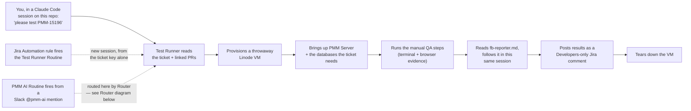
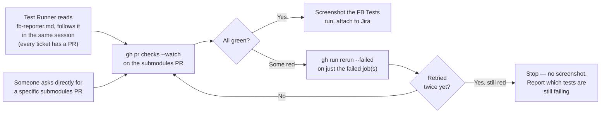
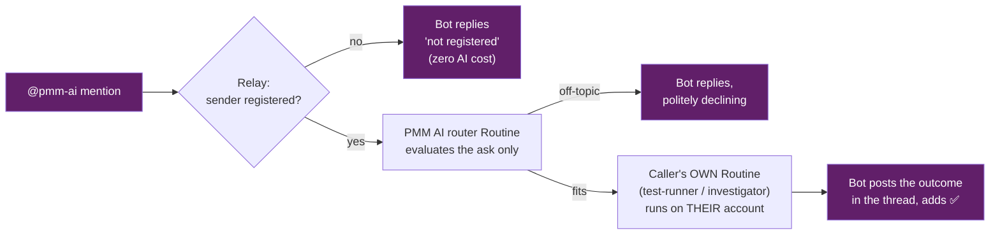
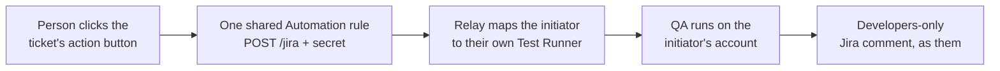

# PMM — Claude Code agents (automations)

Agent behavior lives in `.claude/agents/*.md` and `.claude/skills/*` in this repo — committed, so anyone who opens `percona/pmm-qa` in Claude Code gets all agents automatically. No separate environment snapshot or dashboard config to keep in sync (unlike the earlier Cursor prototype this replaces).

## The four agents

| Agent | Watches / invoked by | Trigger | Does | Never |
|-------|----------------------|---------|------|-------|
| [test-runner](../../.claude/agents/test-runner.md) | A named Jira ticket | Ad hoc — chat, a Jira Automation rule, or a Slack `@pmm-ai` mention routed here by `router` | Reads the ticket, provisions a throwaway Linode VM, runs the manual QA, hands off to `fb-reporter` for the linked submodules PR's evidence, posts a Developers-only Jira comment | Open PRs outside pmm-qa, post public Jira comments |
| [investigator](../../.claude/agents/investigator.md) | **pmm-qa's own** scheduled CI on `main`, `Percona-Lab/pmm-submodules` FB Tests going red, or asked directly (including via `router`) | CI-triggered from both sources (see below), or asked directly | One pipeline (dedup → reproduce → classify) regardless of trigger — classifies **from what actually reproduced**: didn't reproduce, not-a-bug, or a genuine bug that routes to a product-bug report, an ordinary pmm-qa fix+PR, or a blocked draft PR | Fix `percona/pmm`/`percona/grafana`, clone `pmm-submodules`, classify or answer a question without reproducing first |
| [fb-reporter](../../.claude/agents/fb-reporter.md) | Referenced by `test-runner`, or asked directly | N/A — read-and-followed in the caller's own session, or invoked directly | Gets a clean FB Tests screenshot for a ticket's linked submodules PR, retrying past flakiness (`gh run rerun --failed`, up to twice), attaches to Jira | Diagnose or fix a genuine (non-flaky) failure — that's `investigator`'s job |
| [router](../../.claude/agents/router.md) | The `PMM AI` Routine, fired by a Slack `@pmm-ai` mention | Slack-only — see "PMM AI" below | Matches the mention to test-runner / investigator / fb-reporter by description and hands off, or answers directly if it's just a question | Guess a ticket key/PR number that wasn't in the message, do the matched agent's work itself |

There's no separate "watcher" agent in front of Investigator. An earlier draft had one (detect the failure, hand off to a shared fixer) — dropped once it became clear the "detect" step was too thin to be its own agent: parsing a trigger payload and extracting a failure list is just Investigator's own first step, not a separable concern the way `fb-reporter`'s screenshot-and-retry job genuinely is.

Why `fb-reporter` (and `router`) isn't spawned as a nested subagent from whatever calls it: whether a Claude Code Remote **Routine**-fired session can itself spawn a custom subagent via the Agent/Task tool isn't confirmed by Claude Code's own docs — `investigator`, `test-runner`, and `PMM AI` all run as Routines, so none of them risk depending on that. Instead, the calling agent's own instructions say to read the target `.md` file directly and follow it in the same session — the same mechanical pattern already used for skills. Each is still a real agent (its own `name`/`description`), so a person in an ordinary interactive session (where subagent-spawning is confirmed to work) can invoke any of them directly, or just ask in natural language.

## Running Test Runner manually

In any Claude Code session on this repo, just ask in natural language — "please test PMM-15196". The agent description matching picks the role; no slash-command prefix required.

## Running Test Runner from Slack

Not Claude Tag (the official Slack app) — it pairs one Slack workspace to one Claude org, and this project's Claude identity isn't the one already paired to the team's workspace. Slack triggering here goes through the custom **`@pmm-ai`** app + relay instead (built — the app awaits admin approval; ops in [`.claude/integrations/slack/README.md`](../../.claude/integrations/slack/README.md)): a **registered** person mentions `@pmm-ai`, the relay fires the central `PMM AI` Routine, which reads [`router.md`](../../.claude/agents/router.md) and only *evaluates and routes* — if the ask fits one of the caller's own routines (e.g. their Test Runner), it hands off through the relay's `/route` endpoint and the work runs **on the caller's own account**; off-topic asks get a short decline, and unregistered users are answered by the relay itself at zero AI cost. A mention never goes straight to Test Runner; it always passes through Router first. See "PMM AI" below for the full picture.

## Running Test Runner from Jira

**Live**: a Jira Automation rule fires an action button on the ticket, sending a plain HTTPS POST to the Test Runner Routine's API trigger whenever a ticket moves to Ready for QA or In QA. The `text` field in that POST isn't limited to a bare ticket key: it's appended as an extra turn on top of the routine's own prompt, so it can carry as much context as you want (summary, priority, whatever Jira smart-values you include).

Not yet per-person: the button fires the one shared Test Runner Routine, so results post under its creator's identity regardless of who clicked it or which ticket it's on. See "Per-person routing in Router" in the go-live checklist below for what closes that gap.

```bash
curl -X POST https://api.anthropic.com/v1/claude_code/routines/<routine_id>/fire \
  -H "Authorization: Bearer <token>" \
  -H "anthropic-version: 2023-06-01" \
  -H "anthropic-beta: experimental-cc-routine-2026-04-01" \
  -H "Content-Type: application/json" \
  -d '{"text": "{{issue.key}}"}'
```

`<routine_id>` and `<token>` come from opening the Test Runner routine in the claude.ai Routines UI and clicking **"Add an API trigger"** — the token is shown once and can't be retrieved again. Configure a Jira Automation "Send web request" action with the above.

### Test Runner flow



A1 is interactive (agent-matching finds Test Runner by description); A2 and A3 both spin up a fresh session from nothing, but only A2 is Test Runner's own Routine firing directly — A3 is Router's Routine firing and then, within that same session, becoming Test Runner. The FB Reporter step is a direct file-read, not a nested subagent spawn — same reasoning as the Router diagram below.

## Investigator — event-triggered from both sources, no polling

`Percona-Lab/pmm-submodules` is also a Percona-owned repo, not a third party's — so unlike an earlier design, there's no need for an hourly polling Routine to catch FB Tests going red. Both of Investigator's sources push an event directly:

- **pmm-qa's own scheduled CI**: [`.github/workflows/notify-investigator.yml`](../../.github/workflows/notify-investigator.yml), already in this repo, fires on `workflow_run` for `e2e-tests-matrix.yml`, `gssapi-psmdb-tests-matrix.yml`, `helm-tests.yml`, `integration-cli-tests.yml` (native GitHub Actions cron), plus `nightly-e2e-tests-matrix.yml` (dispatched daily by the Jenkins pipeline in `jenkins-pipelines`, matched by name since it's not a GitHub cron). It fires on the run's own computed `conclusion`, not any single job's pass/fail — some of these pipelines pass their e2e-test step but fail overall once a later Launchable step errors collecting results, and a hand-maintained per-job list would miss that.
- **`Percona-Lab/pmm-submodules` FB Tests**: **needs a mirroring notify workflow added in that repo**, firing the same Investigator Routine with the submodules PR number + run URL. Not built yet — this is a go-live item, not something this repo alone can finish (needs push access to that other repo).

Only one secret is needed:

- `INVESTIGATOR_ROUTINE_TOKEN` — the bearer token from the routine's "Add an API trigger" screen. The routine ID itself (`trig_01FhHBdz2yBibyVEfnG5gbQz`) is hardcoded in the watcher file — it isn't sensitive, only the token is.

**Not fully wired up yet** — the pmm-qa side (`notify-investigator.yml`) is in place but needs `INVESTIGATOR_ROUTINE_TOKEN` added as a repo secret; the pmm-submodules side doesn't exist yet at all.

Investigator also answers a question or a suspected customer-reported bug directly (in chat, or routed from a Slack `@pmm-ai` mention via `router`) — this isn't a separate flow, just a different way into the **same** dedup → reproduce → classify pipeline as a CI/FB event: dedup checks for an existing Jira ticket instead of an open PR (there's no failing test to match against an open-PR marker), and reproduction walks the described scenario instead of re-running a failing command. Classification after that is the same tree either way — didn't reproduce (say so, ask for more detail), described scenario isn't an actual bug (explain the right way, grounded in the reproduction and the code, never a guess — this outcome only applies here, a CI/FB failure that reproduces is never "not a bug"), or a confirmed bug, which then routes to product (report, no fix) or pmm-qa's own test code (fix). See `investigator.md` workflow step 3. This is also why a separate "support-triage" agent, floated earlier for a prod/support Slack channel, was dropped — it would have just duplicated this.

A second Investigator nuance worth calling out: when the FB source is the one that triggered it, a "test bug" fix isn't always a normal, ready-to-merge PR. Submodules tests occasionally get updated *ahead of* the upstream `percona/pmm`/`percona/grafana` PR that will actually introduce the behavior they now expect. Investigator checks for that (an open, not-yet-merged upstream PR touching the same area) before opening a PR — if one exists, it opens the fix as a **draft PR** noting what it's blocked on, instead of a normal one, since merging it before the upstream change lands would just break `main`.

### Investigator flow


No gate asking "was someone waiting for an answer" — that's already implied by which outcome you land on. "Described scenario is not an actual bug" only ever applies when someone described a scenario to check in the first place; a CI/FB failure that reproduces is never that outcome, it's always "confirmed bug." The only real fork is "where does it actually live?" (P) — test vs. product. The draft-PR branch (I → K) only applies when an FB-triggered test bug is anticipating a not-yet-merged upstream PR — merging it early would break `main`.

## FB Reporter — no Routine of its own

No trigger or Routine of its own — it's read-and-followed by `test-runner` (see "why not spawned as a nested subagent" above), or invoked directly by a person. Nothing to wire up here beyond the file itself existing.

### FB Reporter flow



The retry loop caps at 2 total re-checks. Still red after that stops here on purpose — diagnosing or fixing it is Investigator's job, not FB Reporter's.

## PMM AI — custom Slack app + relay (built; app awaiting Slack admin approval)

Claude Tag can't have a second identity in a workspace already paired to
another Claude org, so Slack triggering for this project uses its own small
app, `@pmm-ai`, plus a relay on the `pmm-ai-relay` Linode. Everything is
built and deployed except the Slack app itself, which needs workspace admin
approval — created from
[`.claude/integrations/slack/manifest.yaml`](../../.claude/integrations/slack/manifest.yaml)
(Socket Mode, read-only events + `chat:write`/`reactions:write`; full ops
docs in
[`.claude/integrations/slack/README.md`](../../.claude/integrations/slack/README.md)).

**What the Slack app is and isn't** (the approval-relevant part): it holds no
credentials to anything outside Slack, exposes no public URL (Socket Mode =
outbound-only connection from our server), and can only read messages in
channels it is explicitly invited to, react (👀 received / ✅ done), and
reply in threads. All AI work happens in Claude Code Routines on the
existing QA account(s); the app is just the doorbell and the mailbox.

### PMM AI flow — three entry points, one relay

Purple = the Slack app being requested. Everything else already exists and
works without it.

**1 — `@pmm-ai` mention** (the app delivers the mention and posts the replies):



**2 — watched alerts channel** (future; the app delivers the messages):


**3 — Jira ticket button** (works with no Slack app at all):



The app itself holds no credentials to anything outside Slack, has no public
URL (Socket Mode — outbound connection only), and can only read channels it
is invited to, react 👀/✅, and reply in threads. All routine tokens stay on
the relay server; all AI work runs in Claude Code Routines on the team's own
accounts.

## Routine ownership — read before relying on this

Confirmed from the docs: a Routine's fired session runs under **its creator's personal identity** — commits, PRs, and connector actions (Slack, Jira, GitHub) all appear as that person, using their connectors. There is no service-account or shared-identity option today. If the creator's connector auth lapses or they leave the team, the Routine breaks silently — there's no documented mitigation beyond recreating it under someone else's account. Sharing a session link is also one-way: a teammate can view the latest state, but it does not update live and isn't collaboratively editable — there's no "shared chat everyone works in together" mechanism.

## Linode cost-safety net

Test Runner and Investigator both provision a throwaway Linode VM per run (`terraform/linode-runner/`, see [linode-provisioning](../../.claude/skills/linode-provisioning/SKILL.md)) — FB Reporter never does, it only calls `gh`/Jira. Primary cleanup is the agent calling `down.sh` as its last step, on every exit path. The backstop is **not** a scheduled Routine — every instance carries its own on-box self-destruct timer (default 24h, see `terraform/linode-runner/README.md`) that deletes it via the Linode API with no external process involved. `extend.sh` pushes that timer back if a run needs more time.

## Go-live checklist — remaining steps (1 step = 1 box)

**Launch core (Jira button → Test Runner):**

- [ ] **Before merging #1143 — hand-fix its `.claude/settings.json` linode-runner rules** (a human must do this: an agent is hard-blocked from editing its own permission file, see findings log). The five `Bash(*linode-runner/*.sh *)` entries match nothing, so merging as-is looks like the fix landed while changing nothing.
- [ ] Merge [PR #1143](https://github.com/percona/pmm-qa/pull/1143)
- [ ] After merge: make any trivial edit to the qa-linode environment's setup script (forces the settings cache to rebuild now instead of in ~7 days)
- [ ] Merge [Percona-Lab/pmm-submodules#4511](https://github.com/Percona-Lab/pmm-submodules/pull/4511) (its secret is already in place)

**Slack app + relay (in order):**

- [x] Reserved the relay's public IP `139.162.176.43` (Frankfurt, tag `pmm-ai`) 2026-08-08 — survives delete/rebuild, so the hostname + Let's Encrypt cert stay valid and the endpoint can't be reassigned to a stranger
- [ ] Use dedicated service credentials in the environment (both are plaintext-visible to env users): a **Jira service account** (e.g. "PMM QA Bot") for `JIRA_EMAIL`/`JIRA_API_TOKEN` so comments post neutrally, and a **restricted Linode PAT** (Linodes + Firewalls R/W only) for `LINODE_TOKEN`
- [x] Relay infrastructure verified end-to-end 2026-08-07 (Linode up, Let's Encrypt cert trusted through the session egress proxy, /health 200, /reply and /jira auth gates 403, davi.json loaded, crash-on-bad-token fixed)
- [x] Create the Slack app from `manifest.yaml` (done 2026-08-08)
- [ ] Request admin approval and install the app to the workspace
- [ ] Generate the App-Level Token (`xapp-`): app page → Basic Information → App-Level Tokens → Generate, scope `connections:write`
- [ ] Copy the Bot Token (`xoxb-`): app page → OAuth & Permissions → Bot User OAuth Token
- [x] Generate the PMM AI routine's API token (done 2026-08-07, stored in the LastPass **PMM** note)
- [x] Get the Test Runner routine's token (done 2026-08-07, stored in the LastPass **PMM** note)
- [ ] Give a Claude session on this repo the 2 Slack app tokens + the routine tokens and root password from the LastPass note, and ask it to finish the relay setup — it rebuilds the server with the completed `.env` baked in (no SSH, no LastPass CLI needed)
- [ ] Update the LastPass **PMM** Secure Note `pmm-ai-relay.env` with the final completed `.env` (after the app tokens exist)
- [ ] `/invite @pmm-ai` into a test channel, mention it — expect 👀, then a reply
- [ ] Update the **Jira Button automation** to the new request: POST `https://139-162-176-43.ip.linodeusercontent.com/jira`, header `X-Relay-Secret: <JIRA_RELAY_SECRET from the .env>`, body `{"accountId":"{{initiator.accountId}}","text":"<ticket key + what to do>"}`, "Wait for response" ON
- [ ] In the same rule, add a condition `{{webResponse.status}} == 404` → Add comment telling the initiator they are not onboarded yet (404 is ONLY not-registered; other errors mean relay/platform trouble, not a user problem)
- [ ] Click the Jira button on a test ticket and confirm the run starts under your Test Runner

**Later / optional:**

- [ ] Onboard each teammate: they create their own Routine(s) + API token in their claude.ai and send slack ID, jira accountId, routine id+token — becomes one small `people/<name>.json` on the relay (hot-reloaded, no restart; template in `.claude/integrations/slack/relay/person.example.json`), mirrored as a Secure Note in the LastPass PMM folder. They do NOT connect personal Slack/Jira MCP connectors — Slack replies go through the relay bot, Jira posts go through the shared REST token in the environment. Their routine must run in the shared team environment (or a personal one carrying the same env vars).
- [ ] (optional) Map an alerts channel to Investigator via `CHANNEL_ROUTINES` in the relay `.env`
- [ ] Team-wide shared Claude Code environment (admin creates at claude.ai/admin-settings so every teammate's routine runs identically). Exact config:
  - **Network**: Full (current) — or Custom incl. `perconadev.atlassian.net` + the relay host.
  - **Env vars (all plaintext-visible to env users → use least-privilege service credentials)**: `LINODE_TOKEN` (VM provisioning), `JIRA_EMAIL` + `JIRA_API_TOKEN` (curl-first Jira posting). **Remove `PMM_AI_SLACK_BOT_TOKEN`** — stale: the Slack bot token lives ONLY on the relay server, fired sessions never use it.
  - **Setup script**: the `/root/.claude/settings.json` bootstrap (hooks + permissions for multi-repo sessions).
  - **Identity note**: per-person GitHub identity works (each person's own routine). Jira posts, however, all use the shared `JIRA_API_TOKEN` = one identity, until connector bug #61015 is fixed and Jira can move back to the per-person connector.

## Findings log (reference — done items and long-form context)

- [x] `LINODE_TOKEN` available to sessions that need it — **no real secrets store exists yet** in the environment config; anything set there is plaintext-visible to every teammate with access to that environment. Use a least-privilege, access-controlled Linode API token (scoped to Linode/Firewall create-delete only, not full account access) rather than a personal full-access token — and note it still flows into `TF_VAR_linode_token`, gets templated into each instance's cloud-init `user_data`, and is persisted in that run's local `terraform.tfstate`; this is an accepted tradeoff of the current design (throwaway VMs, short TTL, no shared state backend), not an oversight, but it's why the token's scope matters more than usual here.
- [x] **Jira connector broken in Routine runs — workaround complete** ([claude-code#61015](https://github.com/anthropics/claude-code/issues/61015): approval demanded despite the connector being attached; closed upstream but still reproduced 2026-08-06 on PMM-15188). The `jira` skill is **curl-first** (REST, no approval gate); `JIRA_EMAIL` + `JIRA_API_TOKEN` added to the qa-linode environment 2026-08-06. Both connector rule spellings kept duplicated in settings.json so whichever the platform honors post-fix is already covered.
- [x] GitHub connector activated for the org
- [x] `gh --version`, `terraform version`, `json-diff --version`, `ffmpeg -version` succeed after a fresh SessionStart hook run
- [x] Connector permission prompts — understood, not repo-fixable: in web sessions the prompt is **enforced by the claude.ai host layer** — no `permissions.allow` spelling and no PreToolUse allow-hook can suppress it (all tested live 2026-08-06). Routine runs are governed by the Routine's own connector list instead (once #61015 is fixed). Consequently settings.json allowlists only `mcp__github`, the one MCP entry that verifiably works (project-provisioned server). Useful facts: settings/hook edits hot-reload mid-session; connector server names vary across sessions (`Atlassian_Rovo` vs `Atlassian-Rovo`); an agent cannot see whether a prompt fired — verification needs a human watching.
- [ ] **Provisioning is blocked in Routine runs by the auto-mode classifier — needs a human-applied settings fix.** Hit live on 2026-08-10: Investigator fired on a red `E2E tests Matrix` run, got through dedup, then `terraform/linode-runner/up.sh investigator <run_id>` was denied ("Blocked by classifier"), so it could not reproduce and closed with no verdict. Mechanics, all observed in that run:
  - The allowlist is not what adjudicated it. `permissions.allow` holds bare tool names, and a bare `"Bash"` entry does **not** count as a shell pre-authorization — the command still went to the classifier, which judged `terraform apply` (billable infra, firewall to `0.0.0.0/0`, irreversible) as needing a human. Ordinary `git`/`python3`/`grep` passed untouched, so this is content-based, not a blanket Bash denial. `defaultMode: acceptEdits` is irrelevant here: it auto-accepts *file edits*, not Bash.
  - The rules currently in #1143 cannot work: `Bash(*linode-runner/up.sh *)` leads with `*`, but Bash rules are **prefix** matches, not globs. They have also never been active in a Routine — those runs read `/root/.claude/settings.json`, planted from `main`, which has no such entries.
  - A path-prefix rule is fragile regardless: the shell cwd is the repo root but is not guaranteed stable (observed resetting to `/home/user` mid-session), and the README's own `PMM_QA_REF=<branch> up.sh …` form does not *start* with the script path. Hence the `autoMode.allow` entry below, which is path- and prefix-agnostic, is the primary lever; the `Bash(...)` rules are the cheap documented fast path.
  - **An agent cannot apply this itself.** Editing `.claude/settings.json` is refused even with the user explicitly asking for it in-session — a hard boundary (self-escalation), not a soft prompt, and correctly so: an agent able to grant itself provisioning rights defeats the permission system. Do not expect a future agent run to fix this; a human edits the file.

  Replacement for the five broken entries, plus the classifier lever (`"$defaults"` must stay, it inherits the built-in rules):

  ```json
  "Bash(terraform/linode-runner/up.sh:*)",
  "Bash(terraform/linode-runner/run.sh:*)",
  "Bash(terraform/linode-runner/sync.sh:*)",
  "Bash(terraform/linode-runner/extend.sh:*)",
  "Bash(terraform/linode-runner/down.sh:*)"
  ```

  ```json
  "autoMode": {
    "allow": [
      "$defaults",
      "Provisioning, driving and tearing down this repository's throwaway QA VMs via terraform/linode-runner/up.sh, run.sh, sync.sh, extend.sh and down.sh -- at any path prefix, and including invocations led by environment assignments such as PMM_QA_REF=, ALLOWED_INBOUND_CIDR=, DOCKER_VERSION= or CLIENT_VERSION=. These are single-run, self-destructing Linode instances (on-box systemd TTL timer, default 24h) created by the test-runner and investigator agents and by this repo's scheduled Routines. Standing up one is the expected first step of any reproduction and down.sh destroying one is the mandatory last step; neither is an unusual or unintended side effect here."
    ]
  }
  ```

  Zero-cost verification after applying: run `terraform/linode-runner/up.sh` with no arguments. It exits on `ROLE="${1:?usage…}"` before `mkdir`, before terraform, before anything billable — a usage line instead of a denial means the rule works and nothing was created. Deliberately **not** recommended: `defaultMode: bypassPermissions` or `disableAutoMode`, either of which fixes this in one line and also switches off the thing that would stop a genuinely bad command in an unattended run.
- [x] `INVESTIGATOR_ROUTINE_TOKEN` added as a repo secret so `notify-investigator.yml` can actually fire
- [x] Live Claude Code Remote Routines updated to match this architecture (Test Doctor renamed to Investigator, FB Validator handled) — see "Updating the live Routines" below for what changed
- [x] **Cross-org access to `Percona-Lab/*` — solved: attach the repo at session/Routine creation** (multi-repo, verified live 2026-08-06: `gh api` on both repos and `gh run rerun <id> --failed -R Percona-Lab/pmm-submodules` all work). Single-repo sessions stay blocked by design: mid-session `add_repo` is refused cross-tier, and a PAT env var can never widen scope (the proxy swaps credentials and enforces scope itself). Fallbacks in an unattached session: anonymous git read, or data passed in via the trigger payload. Details for agents live in the `repos` skill.
- [x] **Multi-repo sessions load no project settings** — they root at `/home/user` (the *parent* of the clones, `$CLAUDE_PROJECT_DIR` unset), so `settings.json` (hooks + permissions) loads from nowhere, though `CLAUDE.md`/agents/skills still load. **Fixed and verified end-to-end 2026-08-06**: the environment setup script below plants the committed settings at user scope (`/root/.claude/settings.json`), which cloud sessions honor — SessionStart tooling, clone guard, and allowlist all active in a fresh multi-repo session with zero prompts. **Applied to the qa-linode environment 2026-08-06.** Caveats: setup-script results are snapshot-cached ~7 days (touch the script to force a rebuild after settings changes on main); the allowlist applies to every session in that environment. Environment setup script (web-UI-only config; this snippet is the record):

  ```bash
  # pmm-qa: plant hooks+permissions as user-scope settings so they load in
  # multi-repo sessions (which root at /home/user, loading no project settings)
  mkdir -p /root/.claude
  if [ -f /home/user/pmm-qa/.claude/settings.json ]; then
    cp /home/user/pmm-qa/.claude/settings.json /root/.claude/settings.json
  else
    curl -fsSL --max-time 30 \
      https://raw.githubusercontent.com/percona/pmm-qa/main/.claude/settings.json \
      -o /root/.claude/settings.json || echo "WARN: pmm-qa settings fetch failed" >&2
  fi
  exit 0
  ```

- [x] Repos added to Routine repository lists 2026-08-06: `pmm-qa`, `pmm`, `grafana`, `Percona-Lab/pmm-submodules`, `Percona-Lab/jenkins-pipelines` on both live Routines (Test Runner, Investigator) — enables cross-org `gh api`/CI re-runs in their runs. Note: these runs are now multi-repo sessions (root at `/home/user`), so their hooks/permissions come from the qa-linode setup script (item above), not project settings. **To do**: archive the throwaway `qa-settings-test` environment.
- (tracked in checklist above) Notify workflow added in `Percona-Lab/pmm-submodules` firing the same Investigator Routine on FB Tests red — **PR open**: [Percona-Lab/pmm-submodules#4511](https://github.com/Percona-Lab/pmm-submodules/pull/4511), watches the real "FB Tests" workflow's `workflow_run` conclusion (confirmed against that repo's actual CI, not assumed), resolves the PR number with a commit-SHA fallback for when `workflow_run.pull_requests` is empty. Secret `INVESTIGATOR_ROUTINE_TOKEN` added in that repo 2026-08-06; only the merge of #4511 remains.
- [x] Jira Automation rule configured with Test Runner's API trigger URL/token — an action button fires it when a ticket moves to Ready for QA or In QA. Not per-person yet: it fires the one shared Test Runner Routine regardless of who clicked it (see "Per-person routing in Router" below).
- (tracked in checklist above) PMM AI Slack app + relay — **built and deployed** (see [.claude/integrations/slack/](../../.claude/integrations/slack/README.md)): Socket Mode relay on the `pmm-ai-relay` Linode (`139.162.176.43`, eu-central, $5/mo, rebuild-never-delete), `PMM AI` router Routine created (`trig_01MJNKVHiPqrZ3Ajv1fzUdQK`, qa-linode, reads `router.md`, evaluate-and-route only). Entry points: `@mention` → router → hand-off to the caller's own routine via `/route`; `POST /jira` → initiator's own test-runner; watched channels (`CHANNEL_ROUTINES`) → Investigator on the QA owner's account. **Remaining**: (1) admin approves the Slack app (create from [`manifest.yaml`](../../.claude/integrations/slack/manifest.yaml) — final); (2) fill the 4 FILL-ME tokens in `/opt/pmm-ai-relay/.env` (instructions inline; keep the full file + root password in the LastPass **PMM** shared folder), `touch .env.ready`, `systemctl start pmm-ai-relay`; (3) `/invite @pmm-ai`, test that a mention gets 👀; (4) repoint the Jira Automation rule at `https://139-162-176-43.ip.linodeusercontent.com/jira` with the `X-Relay-Secret` header.
- (tracked in checklist above) Per-person routing — **designed and implemented in the relay** (the token-storage question is settled: per-person routine tokens live only in the relay server's `.env` + the LastPass **PMM** folder — never in this repo, never in shared env vars). `PEOPLE` maps each person → Slack ID + Jira accountId + their own routines (`test-runner`, `investigator`, …); unregistered mentions are rejected relay-side at zero cost; the central router hands off via `/route` so work runs on (and bills to) the caller's account. **Remaining**: onboard each teammate — they create their own Routine(s) in their claude.ai (prompt: "Read .claude/agents/<agent>.md and follow it", env qa-linode, API trigger + token) and send the 4 fields to whoever admins the relay `.env`.
- (tracked in checklist above) Team-wide shared Claude Code environment created (or an existing one reused) with `LINODE_TOKEN` set once at the environment level — teammates using that shared environment don't need their own Linode token; they still each connect their own Jira/Atlassian connector so Jira comments post as them.

## Updating the live Routines

Three Routines existed from an earlier iteration of this design; **all three are now updated and confirmed working**:

| Routine (current name) | Trigger ID | What changed |
|---|---|---|
| Test Runner | `trig_01HmhmybBxMn21FRzfqosE2t` | Nothing — its prompt already just said "read `.claude/agents/test-runner.md` and act as that role," so it picked up `test-runner.md`'s changes (the `fb-reporter` hand-off) automatically. |
| Investigator (was "Test Doctor") | `trig_01FhHBdz2yBibyVEfnG5gbQz` | Renamed, prompt updated to read `.claude/agents/investigator.md`. Same trigger ID — `notify-investigator.yml` already pointed at it. |
| FB Validator | `trig_01E3y6NS23kjsUt4eaS722FA` | Resolved (either repointed to `investigator.md` or disabled — see whichever was actually done). |
