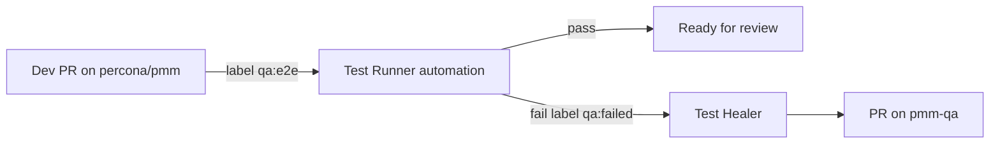

# Handoff — dev → QA (Phase 3)

## Within one run

Test Runner reads skills inline (no thin subagents required):

1. `pmm-git-diff` — scope from PRs
2. `pmm-provisioning` — server + DBs via `cursor-qa-integration/`
3. `pmm-fb-tests` — map failed checks to CodeceptJS (`codeceptjs-e2e/`) or Playwright (`e2e_tests/`) runners

**Prerequisite:** [VALIDATION.md](VALIDATION.md) items 3–4 pass on cloud.

## Between runs (PR labels)

Use GitHub Automation triggers (documented):

### Label conventions

| Label | Meaning |
|-------|---------|
| `qa:e2e` | Request Test Runner cloud QA on this PR |
| `qa:failed` | QA failed — trigger Healer triage |

### Automation setup

1. GitHub → PR label changed → `percona/pmm` or `percona/grafana`
2. Filter label `qa:e2e`
3. Pointer prompt → `test-runner.md` with PR context from event

Repeat for `qa:failed` → `test-healer.md`.

## Test Healer dedup

Before opening a pmm-qa PR, Healer checks `gh pr list -R percona/pmm-qa --state open` for the same failing test. Optional `#pmm-ai` canvas rows for team visibility — see `test-healer.md`.

## Future: dev-implementer role

Add `.cursor/agents/dev-implementer.md` + skills; `/dev-implementer` or auto-delegation by description.

Cloud environment `PMM` already includes `pmm` + `pmm-qa` for compile + e2e in one VM.
