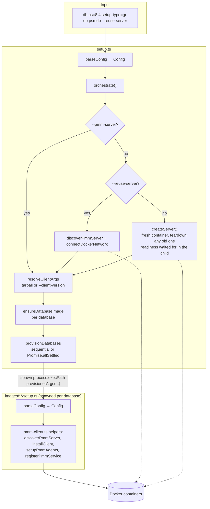
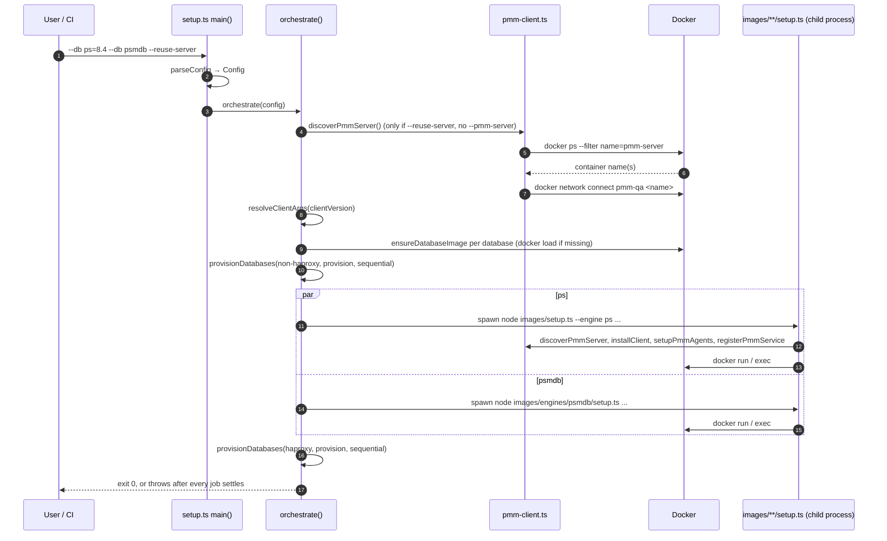

# provisioning/ (TypeScript) — architecture and contribution guide

How the Docker-native provisioner is put together, what happens on a run, and
the exact steps to extend it. It mimics
[`qa-integration/pmm_qa/pmm-framework/`](../qa-integration/pmm_qa/pmm-framework/ARCHITECTURE.md)
(the bash reference), but unlike bash's pure dispatcher, `provisioning/` also
owns PMM Server's lifecycle: it can create a fresh server, reuse a running
one, or connect to one you already point it at.

---

## 1. The big picture



**The one rule to remember:** `setup.ts` never touches a database container
directly. `provisionerArgs()` builds a CLI invocation for the matching
`images/**/setup.ts`, `orchestrate()` spawns it as a child process, and
that child owns every container it creates.

---

## 2. Module map

| File | Responsibility | Depends on |
|---|---|---|
| `setup.ts` | `parseConfig`/`parseDatabase` (the catalogue is `DATABASES`; `TYPE_ALIASES`/`OPTION_ALIASES`/`VERSION_ENV` carry pmm-framework's spellings), `orchestrate`, server lifecycle, `provisionerArgs`, teardown | `pmm-client.ts`, `images/setup.ts` (for `mysqlContainerName`), `images/engines/pxc/setup.ts`, `images/lib/engines.ts` |
| `pmm-client.ts` | Shared CLI options, Docker wrapper, PMM preparation/configuration, service registration, tarball caching | nothing in `provisioning/` |
| `images/build.ts` | `dockerBuildArgs(descriptor)` — one Dockerfile build per engine/version, `npm run build --` entry point | `setup.ts` (`DATABASES`), `lib/engines.ts` |
| `images/lib/engines.ts` | Static per-engine metadata for MySQL/PS (container prefixes, PMM environment/cluster names, minimum node counts) | nothing in `provisioning/` |
| `images/setup.ts` | mysql/ps engine: topology, container naming, workload seeding | `pmm-client.ts`, `lib/engines.ts` |
| `images/engines/*/setup.ts` | One engine per database family (pxc, psmdb/mongodb, pgsql, pdpgsql, valkey, services (haproxy/external), minio (bucket), mlaunch) | `pmm-client.ts` |
| `images/engines/*/Dockerfile` | The image each engine's `setup.ts` runs `docker run` against | — |

Every `images/**/setup.ts` is independently runnable (`node
engines/psmdb/setup.ts --version 8.0 ...`) and independently testable; nothing
in `provisioning/` imports across engine boundaries except the two
container-naming helpers `setup.ts` needs for `--backends` (see below).

---

## 3. What happens on a run



### Server resolution precedence

1. `--pmm-server HOST` — use it as-is, never create or discover anything.
2. `--reuse-server` (and no `--pmm-server`) — `discoverPmmServer()` finds a
   running `pmm-server*` container, warns if more than one matches, and
   `connectDockerNetwork()` attaches it to the `pmm-qa` network. **No server
   found is fatal** (`no PMM server found; pass --pmm-server or omit
   --reuse-server`) — it never silently falls back to creating one.
3. Default — `createServer()` tears down any previous `pmm-server` container
   and volume and starts a fresh one. It pulls the server image only when
   `serverImageFreshness()` reports `stale` or `unknown`: the registry's
   manifest digest (`docker buildx imagetools inspect`) is compared against the
   local `RepoDigests` entry, which costs about a second and fetches no layer,
   so an unchanged tag skips the pull and a moved tag still gets it. A
   registry that cannot be reached is `unknown`, and `unknown` always pulls.
   `--reuse-server` runs the same check against the reused container's own
   image and prints whether the registry has moved past it.

`ensureDatabaseImage()` loads a `.tar.gz` archive when one is staged, and
otherwise runs `images/build.ts` as a child process for the descriptor the
`--db` entry implies. A caller therefore never has to remember which
`npm run build --` lines its `--db` list needs; staging archives is only a
CI-cache optimisation.

Nothing about building a database needs PMM Server, so `orchestrate()` only
*creates* the container and spawns the engine children straight away — each one
waits for readiness inside `configurePmm()` via `waitForPmmServerReady()`,
right before it installs the client, which is the first step that actually
talks to the server. The boot therefore overlaps the database build instead of
preceding it. `waitForServer()` is used only by a server-only run (no `--db`),
which has nothing to overlap. Two consequences worth knowing: a server that
never becomes ready now fails once per engine child rather than once in the
parent (a container that *exits* during boot fails fast, since
`waitForPmmServerReady` stops polling a non-running container), and `docker`
contention between the booting server and the starting databases means the
saving is `min(remaining boot, database build)` at best — measure it on the
runner shape you care about.

The client tarball and the database image archives need no server either, so
they are fetched concurrently with the server's pull and boot rather than
after it. Every `step()` duration is recorded in `stepTimings`; a run ends by
printing the steps that took at least a second, worst first, including the
engine child processes' own steps (`childStepTimings()` recovers those from
buffered output).

`bucket` needs no server at all (`SERVERLESS_TYPES` in `setup.ts`); a
bucket-only run skips every server step. `npm run build:dockerclients` builds
the `ps`/`pdpgsql`/`psmdb` client images without pretending they are a
provisionable database type.

### Sequential vs parallel

|  | default (parallel) | `--sequential` |
|---|---|---|
| Order | `Promise.allSettled` over the whole non-haproxy group, then the haproxy group | argument order, one at a time |
| Output | buffered per job (`runner(..., quiet=true)`), printed as one block via `reportProvisionResult` once the job settles — but each job's step markers (`==>`/`<==`/`<!!`/`[FAIL]`, see `IMPORTANT_LINE`) are echoed live as `[PS 8.0] ==> …` so a long run is never silent | streamed live (`quiet=false`), matching bash's sequential behaviour |
| On failure | every other job still finishes; `orchestrate` throws once with a count (`N of M ... failed`) | stops at the first failure, like bash |
| Successful logs | one `[LABEL] OK` line, unless `--verbose` | already streamed live; `reportProvisionResult` only ever adds a one-line `OK`/`FAILED` summary here, never re-dumping output that was already printed |

PMM agent jobs start concurrently across nodes, but their `pmm-agent setup`
registration calls are serialized; key generation and post-registration agent
startup/status checks can still overlap. This avoids a pmm-managed 3.9.1 race
where a server that has only just passed `readyz` answers some concurrent
registrations with an unwrapped `Internal server error` (observed once in six
3-node runs). Every registration also retries transient PMM Server errors
(`isTransientServerError` — refused/reset connections, timeouts, `EOF`,
`internal server error`, 5xx); a real misconfiguration such as a bad password
still fails on the first attempt.

After `pmm-admin add`, each engine waits for its exact exporter to report running or
waiting. A failed top-level run writes sanitized Docker state, container logs, and
PMM status to `provisioning-artifacts/`.

Concurrency is the default here (bash defaults to sequential) because
existing callers already rely on the speed, and flipping it would be a real
regression. `haproxy` is always provisioned in its own, later
`provisionDatabases` group so any PS/PXC backend containers it targets via
`--backends` already exist.

### Why there is no conflict-detection code

Bash's MySQL-family and PDPGSQL/PGSQL-replication conflict rules exist
because its Ansible playbooks reuse fixed host ports and `$HOME/...`
directories. In `provisioning/`, every mysql/ps/pxc/psmdb/pgsql/pdpgsql
container name already encodes `engine + setup-type + version`
(`containerName()`/`topology()` in each engine's `setup.ts`). The one place a
fixed host port does appear — PSMDB's `pss` topology publishes `27027:27017`
on its primary node (`engines/psmdb/setup.ts`) — is also the one place the
name is *not* setup-type-prefixed (`topologyPrefix('pss')` is `''`, every
other setup-type gets a `<setup-type>_` prefix), so it can never collide with
another PSMDB topology; a second `psmdb:pss` run is already blocked by the
duplicate-topology check below. `haproxy`/`external`/`bucket` each use one
fixed container name, but each has exactly one `setup-type` value, so that
same check — in `parseConfig()`, keyed on
`` `${type}:${options['setup-type']}` `` — rejects the only collision that
could occur. `mlaunch-psmdb`/`mlaunch-mongodb` keep this property:
`containerName(engine, version, setupType)` folds `setup-type` into the name
even though `mlaunch` runs every node in one container regardless of
topology, so two `mlaunch-psmdb` entries with different `setup-type` never
collide.

---

## 4. How to extend

### Add a database type

1. Register its versions, default, script, and optional selector in `DATABASES`.
2. If it needs no PMM Server, add it to `SERVERLESS_TYPES`.
3. Write `images/engines/<name>/setup.ts` (own `parseConfig`,
   container naming, and `main()`), its `Dockerfile`, and a colocated
   `setup.test.ts`.
4. Add it to `dockerBuildArgs()` in `images/build.ts` so `npm run build
   -- <name>=<version>` produces the image `provisionerArgs()`
   expects.
5. Document the new `--db` form in `HELP` in `setup.ts`.

### Add a global flag

1. Add it to `Config` and to the `parseArgs` options map in `parseConfig()`,
   with a default.
2. Thread it through `orchestrate()` where it applies.
3. Document it in `HELP`.

### Add a new backend

There is only one shape: `runner(file, args, allowFailure, quiet):
Promise<CommandResult>` (the `Runner` type), implemented by `runCommand` and
injected everywhere it's needed for testability. A new backend should return
the same `CommandResult` shape rather than writing straight to
`process.stdout`.

---

### Where provisioning/ deliberately differs from pmm-framework

`provisioning/` accepts pmm-framework's own CLI grammar (`--database`, `--pmm-server-ip`,
`--pmm-server-password`, `--v`, `UPPER_CASE` option keys, and `--parallel`/`--verbosity-level`
which are accepted and ignored), its type aliases (`mlaunch_modb`, `ssl_mlaunch`, `modb`), its
option aliases (`NODES_COUNT`, `BUCKET_NAMES`), and its environment variables, so its callers need
no edits. `provisioning/parity.test.ts` reads every `--database` string out of `.github/workflows/`
and asserts all of them still parse, alongside the alias and environment-variable rules -- a new CI
setup string that this cannot express fails that test rather than a 20-minute job.

**The client tarball cache.** `provisioning/.cache/` is keyed on a hash of the download URL, but
`pmm-client-latest.tar.gz` and the per-OL dynamic builds are *moving* targets, so a hit is
revalidated with `If-Modified-Since` carrying the cached file's own mtime -- 304 keeps it and
re-stamps it, 200 replaces it, and an unreachable build cache falls back to the copy on disk
rather than failing the run. The mtime therefore doubles as the LRU marker: `pruneClientTarballCache()`
drops entries untouched for 14 days after each successful download, which is what stops one
~180MB entry per feature-branch URL from accumulating forever.

**Environment variables.** `parseDatabase()` reproduces pmm-framework's `resolve_value()`
precedence: an exported variable named after a registered option outranks the spec, which outranks
the registered default, and an exported-but-empty variable deliberately wins with an empty value.
`DATABASES[type].envOptions` is the per-type list that gets scanned, so `SETUP_TYPE=gr` never leaks
into a type that never registered it. Versions follow `resolved_version()` instead -- `VERSION_ENV`
maps each type to `MS_VERSION`/`PS_VERSION`/`PXC_VERSION`/`PSMDB_VERSION`/`MODB_VERSION`/
`PGSQL_VERSION`/`PDPGSQL_VERSION`/`VALKEY_VERSION`, and an *empty* value is skipped there. A
`PSMDB_VERSION` carrying a full patch release (`8.0.4-1`) selects the `8.0` series and pins the
release as a `patch=` build option, replacing pmm-framework's downloads-API lookup.
`REDIS_VERSION`/`NODE_PROCESS_VERSION` are build args on the services image rather than playbook
variables, so changing one needs `npm run build -- external`.

The list below is what remains deliberately different. Everything not listed is
expected to behave the same; if it does not, that is a bug.

**Functionally equivalent, mechanism differs** -- no code changes planned:

- **SSL_MYSQL**: `--db mysql=8.0,tls=true`/`--db ps=8.0,tls=true` enables
  MySQL's native TLS and registers the service with `--tls`. This does not
  reproduce pmm-framework's isolated-container-plus-host-side-cert-copy-out
  mechanism. Functionally equivalent (TLS-monitored MySQL); mechanism
  differs.
- **SSL_PSMDB**: the `psmdb` engine's `tls`/`gssapi` options plus its
  Kerberos sidecar container already cover authenticated/encrypted PSMDB.
  pmm-framework's embedded pytest auth suite and compose-override/sed-patch
  mechanism are test-suite mechanics, not provisioning capability, and are
  intentionally not ported.
- **DOCKERCLIENTS**: `--db dockerclients` builds the ps/pdpgsql/psmdb images and provisions
  nothing (the same work `npm run build:dockerclients` does). pmm-framework's specific
  `docker-compose-clients.yaml` rig with fixed container names is a different integration-test
  rig, not reproduced here.

**Moved from provision time to build time.** These were spec options; here they
select which image gets built, because the image is prebaked rather than
assembled by a playbook on every run. `parseDatabase()` rejects the old spelling
with a message naming the replacement:

| pmm-framework | here |
|---|---|
| `PGSM_BRANCH=x` | `npm run build -- pdpgsql=18,pgsm-branch=x` |
| `PXC,TARBALL=<url>` | `npm run build -- pxc=8.0,image=perconalab/percona-xtradb-cluster:8.0.41` |

**`TARBALL` on the other types.** pmm-framework registered `TARBALL` for MYSQL, PS, SSL_MYSQL,
PSMDB, SSL_PSMDB, VALKEY and the MLAUNCH types, but only PXC's playbook ever read it -- the
MySQL and PS playbooks pmm-framework actually dispatches to (`mysql/mysql-setup.yml`,
`percona_server_for_mysql/percona-server-setup.yml`) never mention it. So `TARBALL=` is accepted
and ignored here for exactly the types where it was already inert, and only PXC's reaches a build.
For PXC, a pre-release is consumed as a published image or a `tarball=` build arg, not as a tarball
unpacked at provision time.

**Deliberately dropped versions.** pmm-framework's catalogue carries PGSQL and PDPGSQL 11-13,
PSMDB 4.4/5.0 and MLAUNCH 4.4/5.0. All are past upstream EOL and outside PMM's supported-monitoring
matrix, so they are not built here. PGSQL and PDPGSQL 14-18 *are* supported. Revisit only if PMM's
supported-monitoring matrix still claims one of the dropped versions.

**Stricter by design.** An unknown version or option is fatal here;
pmm-framework logged a note under `--verbose` and silently used its default. The
parity test above is what makes that safe to keep.

**A different default client.** pmm-framework registered `CLIENT_VERSION=3-dev-latest` per type;
here the default is `latest-tarball`. Both install the newest development client, from the
experimental package channel and the PR build cache respectively, and every CI caller sets
`CLIENT_VERSION` explicitly, so the registered default is never what actually runs.

---

## 5. Testing

`node --test`, no separate test runner. Every `setup.ts` has a colocated
`setup.test.ts` next to it (`provisioning/setup.test.ts`,
`provisioning/pmm-client.test.ts`, `provisioning/images/setup.test.ts`,
`provisioning/images/engines/*/setup.test.ts`).

I/O boundaries are dependency-injected so tests never touch Docker:

- `setup.ts`'s `Runner` type — `orchestrate()`, `createServer()`, `teardown()`
  all take a `runner` parameter that defaults to `runCommand` but accepts a
  fake in tests.
- `orchestrate()`'s `discoverServer`/`connectServerToNetwork` parameters
  default to `pmm-client.ts`'s real `discoverPmmServer`/`connectDockerNetwork`
  (which call `execFile` directly, not through `Runner`) and are swapped for
  fakes in `--reuse-server` tests.
- `resolveTarball` — same pattern, defaults to `resolveClientTarball`.

Run everything relevant to `provisioning/`:

```bash
node --test --experimental-test-isolation=none provisioning/setup.test.ts provisioning/pmm-client.test.ts provisioning/images/setup.test.ts provisioning/images/engines/*/setup.test.ts
```

---

## 6. Conventions and gotchas

**ESM with `.ts` extensions.** Every import specifier ends in `.ts` — this
runs directly under Node's type-stripping, no build step.

**Zero dependencies.** Everything here is `node:*` built-ins:
`node:child_process`, `node:util` (`parseArgs`), `node:test` +
`node:assert/strict` for tests.

**Container naming encodes `setup-type`.** This is what lets the "no
conflict-detection needed" conclusion (§3) hold; any new engine with more
than one `setup-type` value must fold it into the container name too.

**Generic `ssl_`/`ssl-` aliasing.** `parseDatabase()` strips a leading
`ssl_`/`ssl-` from any registered type and sets `options.tls = 'true'`.
The selected engine validates whether TLS is supported. `--db ssl_mlaunch-psmdb=8.0` and
`--db ssl-mysql=8.4` both work this way.

**One `--db` per distinct `type:setup-type`.** `parseConfig()` rejects a
second database whose `` `${type}:${options['setup-type']}` `` matches one
already given, even across different versions.

**Every engine is independently runnable.** `images/engines/*/setup.ts`
reads its own CLI flags and framework-compatible environment variables
(mirroring the bash env-var names where one exists), so it can be invoked
directly for debugging without going through `setup.ts` at all.
