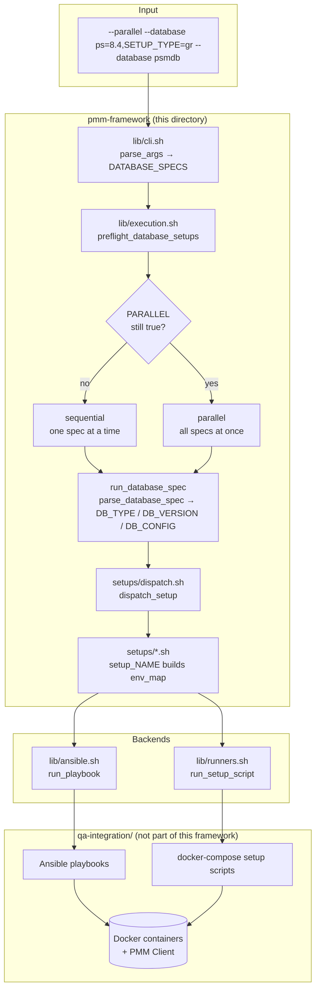
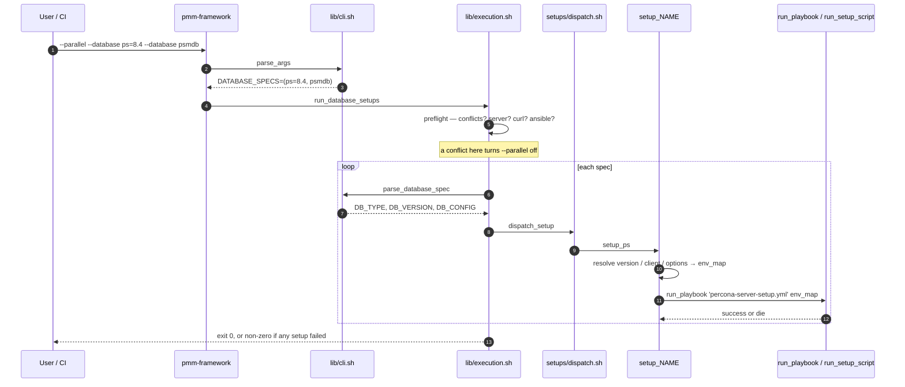
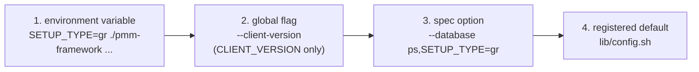

# pmm-framework (Bash) — architecture and contribution guide

How the framework is put together, what happens on a run, and the exact steps
to extend it. For installing and *using* it, see [README.md](README.md).

The framework does not provision anything itself. It is a **dispatcher**: it
turns a `--database` spec into a map of environment variables and hands that to
an existing Ansible playbook or shell script under `qa-integration/`. Almost
every question about behaviour is answered by asking *which env map was built,
and which playbook received it*.

---

## 1. The big picture



**The one rule to remember:** a setup function's only job is to build
`env_map`. That map is the contract with the playbook, which reads it via
`lookup('env', 'KEY')`.

---

## 2. Module map

| File | Responsibility | Depends on |
|---|---|---|
| `pmm-framework` | Bash version gate, path anchors, sources everything, calls `parse_args` then `run_database_setups` | — |
| `lib/common.sh` | `log_*`, `die`, `require_command`, `bool_string`, `normalize_client_version` | nothing |
| `lib/config.sh` | The catalogue: `register_database`, lookups, `resolve_value` | common |
| `lib/cli.sh` | `parse_args`, `parse_database_spec`, `print_help` | common, config |
| `lib/docker.sh` | `discover_pmm_server`, `resolve_pmm_server` | common |
| `lib/ansible.sh` | `run_playbook`, `print_env_map`, collection/interpreter setup | common |
| `lib/runners.sh` | `run_setup_script`, version/password/branch resolvers | common, config, ansible |
| `setups/*.sh` | One `setup_<name>` per type, plus `dispatch_setup` | everything above |
| `lib/execution.sh` | `preflight_database_setups`, sequential and parallel strategies | everything above |

Source order matters only because `lib/config.sh` runs `register_database`
calls and a validation loop at source time — both need `lib/common.sh`'s
`die()` already defined.

---

## 3. What happens on a run



### Preflight

Every spec is parsed once before anything is provisioned, so a bad request
fails in seconds rather than halfway through. Preflight decides:

- **does anything need a PMM Server?** — `BUCKET` and `DOCKERCLIENTS` do not,
  so `--database bucket` works with no server running
- **does anything need `curl`?** — only the PSMDB patch lookup
- **do any two setups conflict?** — see below
- **warm up Ansible** before parallel jobs fork, so they cannot race to install
  the same collection

### The conflict rule

Two setups of the **same type**, or any two of the **MySQL family**
(`PS`/`MYSQL`), reuse the same container names, host ports and data
directories. They cannot run at the same time.

When `--parallel` is asked for and a conflict exists, the framework keeps every
setup and gives up only the concurrency:

```
WARNING: Running setups sequentially: two PS setups cannot run in parallel.
```

This matters because CI passes `--parallel` unconditionally; refusing the run
would fail jobs that are perfectly valid, just not parallelisable.

### Sequential vs parallel

|  | sequential | parallel |
|---|---|---|
| Order | argument order | all at once, reported as they finish |
| Output | streams straight to the console | buffered per setup, printed whole |
| On failure | stops immediately | every setup still finishes, run exits non-zero |
| Successful logs | stream live (not buffered) | summary line only, unless `--verbose` |
| Failed logs | stream live | always dumped, plus the directory is kept |

A **failed** parallel setup always dumps its buffered log — no flag needed,
since that is what makes a broken setup diagnosable. A **successful** one
prints just its summary line, so a green CI run stays short; add `--verbose`
to echo those too when you want to see what a passing setup actually did.

The CI runners deliberately do **not** pass `--verbose`, so day-to-day runs
stay quiet. Individual callers can still opt in through `services_list` /
`setup_services`.

Parallel mode enables job control (`set -m`) so each setup gets its own process
group. That way an interrupt takes down `ansible-playbook` and its children
too, not just the wrapper subshell. It is also why each job gets
`</dev/null` — a background process group that reads the terminal is stopped by
`SIGTTIN` and would hang forever.

---

## 4. Value resolution

Four sources can supply a value. Highest wins:



Two resolvers implement this, and they differ on purpose:

| Helper | Used for | Empty env var |
|---|---|---|
| `resolve_value TYPE KEY MAP` | spec options | **wins** — yields `''`, mirroring Python's `os.environ.get` |
| `resolved_version ENV TYPE REQ` | versions | **skipped** — mirrors Python's `os.getenv(X) or ...` |

> ⚠️ `resolve_value` looks variables up by name, and bash sees non-exported
> shell variables too. Never name a global in `lib/cli.sh` after a registered
> option key, or it will silently win over the spec.

Versions have their own rule: the **order of the version list carries no
meaning**. The default comes from the explicit `DEFAULT_VERSION=` entry, and a
versioned type that omits it fails at startup.

---

## 5. How to extend

### Add a new database type

Three files, in order. Say you are adding `FOODB`:

**1 — register it** in `lib/config.sh`:

```bash
register_database FOODB \
  '1.0 2.0' \
  'CLIENT_VERSION SETUP_TYPE TARBALL' \
  'DEFAULT_VERSION=2.0' \
  'CLIENT_VERSION=3-dev-latest' 'SETUP_TYPE=' 'TARBALL='
```

Every option key needs a matching default — an option without one silently
resolves to `''`.

**2 — write the setup function** in the matching `setups/*.sh` (or a new file,
sourced from `pmm-framework`):

```bash
# FooDB, monitored by PMM.
setup_foodb() {
  local version setup_type client
  version=$(resolved_version FOODB_VERSION FOODB "$DB_VERSION")
  setup_type=$(resolve_value FOODB SETUP_TYPE DB_CONFIG)
  setup_type=${setup_type,,}
  client=$(resolved_client_version FOODB DB_CONFIG)

  declare -A env_map=(
    [PMM_SERVER_IP]="$PMM_SERVER_HOST"
    [FOODB_VERSION]="$version"
    [SETUP_TYPE]="$setup_type"
    [CLIENT_VERSION]="$client"
    [ADMIN_PASSWORD]="$(admin_password)"
    [PMM_QA_GIT_BRANCH]="$(git_branch)"
    [CLIENT_DEBUG]="$(bool_string "$CLIENT_DEBUG")"
  )
  run_playbook 'foodb/foodb-setup.yml' env_map
}
```

Keys must match exactly what the playbook reads. A key the playbook ignores is
dead weight; a key it expects but you omit falls back to the playbook's own
`default(...)` with **no error**, which is the most common way to get a setup
that "succeeds" but is misconfigured.

**3 — wire up dispatch** in `setups/dispatch.sh`:

```bash
FOODB) setup_foodb ;;
```

Then check the two capability predicates:

- `setup_requires_server` (`setups/dispatch.sh`) — add it if it needs **no**
  PMM Server
- `setup_uses_ansible` (`lib/execution.sh`) — add it if it is **script**-backed

**4 — add a test** in `tests/dispatch.bats`. The suite stubs the backends and
asserts on the captured env map, so no containers are involved:

```bash
@test "FooDB selects its playbook and environment" {
  parse_database_spec 'foodb=2.0,SETUP_TYPE=cluster'
  dispatch_setup

  [[ $CAPTURE_KIND == playbook ]]
  [[ $CAPTURE_TARGET == foodb/foodb-setup.yml ]]
  [[ ${CAPTURE_ENV[FOODB_VERSION]} == 2.0 ]]
  [[ ${CAPTURE_ENV[SETUP_TYPE]} == cluster ]]
}
```

### Add a global flag

1. default it in the block at the top of `lib/cli.sh`
2. add a `case` arm in `parse_args` — value-taking flags join the shared arm so
   the "next argument looks like a flag" rule stays in one place
3. document it in `print_help`
4. read it where it applies, usually a key in one or more env maps

Do not name it after a registered option key (see the warning above).

### Add a new backend

`run_playbook` and `run_setup_script` are the only two. Both take
`(target, env_map_name)`, pass variables through `env` rather than exporting,
and `die` on failure. A third backend should follow the same shape and be
reflected in `setup_uses_ansible`.

---

## 6. Testing

```bash
make check     # bash -n, shellcheck -x, and the full bats suite
make test      # bats only
```

Three suites, none of which start a container:

| Suite | Covers |
|---|---|
| `tests/cli.bats` | parsing, precedence, the catalogue, server discovery, log formatting |
| `tests/dispatch.bats` | each type selects the right playbook/script and env map |
| `tests/integration.bats` | the real entrypoint with stubbed `docker`/`ansible-playbook`/`curl` |

`tests/helpers/test_helper.bash` sources the modules and **replaces**
`run_playbook` and `run_setup_script` with capture stubs, so a test can assert
on `CAPTURE_KIND`, `CAPTURE_TARGET` and `CAPTURE_ENV` without provisioning
anything. `reset_framework_state` runs before each test.

`tests/integration.bats` takes the opposite approach: it puts fake `docker`,
`ansible-playbook` and `curl` executables on `PATH` and runs the real
entrypoint end to end.

When you change behaviour, make the test fail first. A test that passes both
before and after a fix is not testing the fix.

---

## 7. Conventions and gotchas

**Bash 5.1 or newer.** The version gate in `pmm-framework` currently says 4.4,
but `wait -n -p` in `run_parallel_setups` needs 5.1 — worth tightening.

**`set -euo pipefail` plus `inherit_errexit`.** A failing `$(...)` aborts the
run instead of yielding an empty string. Beware `local x=$(...)`: `local`
masks the exit status, so always split the declaration from the assignment.

**Value helpers print, predicates return.** `helper` that yields a value writes
it to stdout with no trailing newline; one that answers a question returns 0/1.

**Arrays are passed by name.** Bash cannot pass an associative array by value,
so `run_playbook 'x.yml' env_map` takes the *name* and re-binds it with
`local -n`. That is why a caller must never name a local `env_ref` or
`map_ref` — it would collide with the nameref and error.

**Env maps are written out in full.** The repetition across setup functions is
deliberate; the differences between them are real (`setup_external` omits
`CLIENT_DEBUG`, the PSMDB setups use `PMM_CLIENT_VERSION`). Factoring out the
common keys would hide those asymmetries.

**Unknown versions and options are not fatal.** They are noted under
`--verbose` and the default is used, matching the Python framework so a typo
degrades instead of failing a long CI job. Unknown *database names* are fatal.

**`die` exits the current shell.** At top level that ends the run; inside
`$(...)` or a parallel job it ends only that subshell, and `set -e` propagates
the failure outward.
