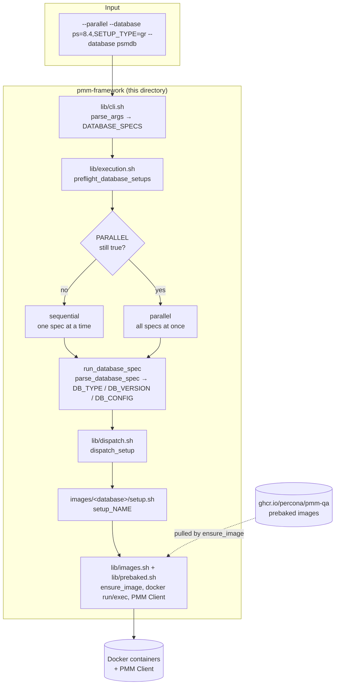
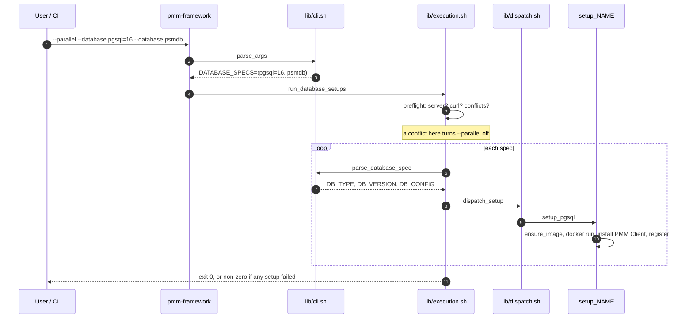
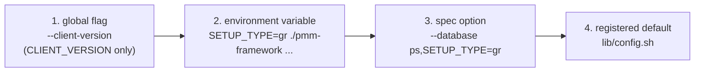

# pmm-framework (Bash) — architecture and contribution guide

How the framework is put together, what happens on a run, and the exact steps
to extend it. For installing and *using* it, see [README.md](README.md).

Every database type runs on a **prebaked image**: the database and its tooling
are baked into an image ahead of time, and the type's setup function starts it
with plain `docker` commands, installs PMM Client at run time and registers the
services. A setup's contract is the **end state** tests look up by name:
container names, host ports, users, and PMM service names and labels.

---

## 1. The big picture



---

## 2. Module map

| Path | Responsibility |
| --- | --- |
| `pmm-framework` | Bash version gate, path anchors, sources everything, calls `parse_args` then `run_database_setups` |
| `lib/common.sh` | `log_*`, `die`, `require_command`, `bool_string`, `normalize_client_version` |
| `lib/config.sh` | The catalogue (`register_database`), `resolve_value`, and the version, client and password resolvers |
| `lib/cli.sh` | `parse_args`, `parse_database_spec`, `print_help` |
| `lib/docker.sh` | `discover_pmm_server`, `resolve_pmm_server` |
| `lib/images.sh` | `build_<engine>_image` per image and `ensure_image` (local, else pull from `PREBAKED_REGISTRY`, else build) |
| `lib/prebaked.sh` | `must`, `step`, `retry`/`retry_on`, `each_node`, PMM Client install, `pmm-agent` setup, exporter waits |
| `lib/fetch-pmm-client-deb.sh` | Fetches a verified PMM Client `.deb` for Debian-family images, waiting out repo.percona.com's publishing race |
| `lib/dispatch.sh` | `dispatch_setup`: the map from a type to its setup function |
| `lib/execution.sh` | `preflight_database_setups`, the sequential and parallel strategies |
| `images/<database>/` | That database's `Dockerfile`, its `setup.sh`, and the files either of them copies in |
| `build-images` | Prebakes images ahead of a run: `./build-images ps=8.4 pxc-proxysql=8.0` |

| `images/` folder | Types | Image |
| --- | --- | --- |
| `ps/` | — (Dockerfile only) | `pmm-qa/ps` |
| `mysql/` | `PS`, `MYSQL`, `SSL_MYSQL` | `pmm-qa/mysql` (SSL MySQL runs on `pmm-qa/ps`) |
| `pxc/` | `PXC` | `pmm-qa/pxc-proxysql`: three nodes and ProxySQL in one container, driven by `pmm-pxc` |
| `psmdb/` | `PSMDB`, `SSL_PSMDB` | `pmm-qa/psmdb`, tagged `replica_member/local` so the `pmm_psmdb-pbm_setup` and `pmm_psmdb_diffauth_setup` compose files run it unchanged |
| `pdpgsql/` | `PDPGSQL`, `SSL_PDPGSQL` | `pmm-qa/pdpgsql` (systemd), and `pmm-qa/ssl-pdpgsql` from `pdpgsql/ssl/` |
| `pgsql/` | `PGSQL` | `pmm-qa/pgsql`; replication runs the official `postgres` image |
| `haproxy/`, `external/`, `valkey/` | `HAPROXY`, `EXTERNAL`, `VALKEY` | one image each |

Source order matters only because `lib/config.sh` runs `register_database`
calls and a validation loop at source time, which need `lib/common.sh`'s
`die()`.

`.github/workflows/build-prebaked-images.yml` builds every image weekly, starts
and checks each one, and publishes it to
`ghcr.io/percona/pmm-qa/<engine>:<version>`. On a push it rebuilds only the
images whose baked-in files changed.

PS and MySQL use their database image twice per node: an unprivileged database
container, and a privileged `nomad_agent_<cksum of node>` companion, labelled
`pmm-qa.parent=<node>`, with the image entrypoint replaced by `sleep`. Its name
must not contain `ps` or `mysql`: tests find the database container by grepping
container names for those. The companion shares the database container's
network and PID namespaces plus its PMM, data and `/tmp` volumes. `pmm-agent`
and Nomad run in the companion; `pmm-admin` remains available in the database
container through the shared PMM installation and local network. This preserves
the CLI suite's container contract without exposing mysqld to writable host
cgroups.

---

## 3. What happens on a run



### Preflight

Every spec is parsed once before anything is provisioned, so a bad request
fails in seconds rather than halfway through. Preflight finds the PMM Server,
checks for `curl` when a `PSMDB` or `SSL_PSMDB` setup needs it, and applies
the conflict rules below.

### The conflict rules

Two setups of the **same type** reuse the same container names and host ports,
and any two of the **MySQL family** (`PS`/`MYSQL`) both publish host ports from
3306. They cannot run at the same time. When `--parallel` is asked for, the
framework keeps every setup and gives up only the concurrency:

```text
WARNING: Running setups sequentially: two PS setups cannot run in parallel.
```

CI passes `--parallel` unconditionally, so refusing would fail valid jobs.

Three pairs cannot share a **host** at all, because each holds the same
container name or host port for as long as it is up:

- **two `PSMDB` setups**: the replica-set and sharded compose files both pin
  `container_name` `rs101`..`rs203` and host port 27027.
- **`EXTERNAL` with `VALKEY`**: both publish host port 6379.
- **`PDPGSQL` patroni with `PGSQL` replication**: both publish host port 6432.

These are refused in preflight, naming the collision:

```text
ERROR: EXTERNAL and VALKEY setups (both publish host port 6379) cannot share a host; provision them on separate machines.
```

### Sequential vs parallel

| | sequential | parallel |
| --- | --- | --- |
| Order | argument order | all at once, reported as they finish |
| Output | streams straight to the console | buffered per setup, printed whole |
| On failure | stops immediately | every setup still finishes, run exits non-zero |
| Successful logs | stream live | summary line and agent states only, unless `--verbose` |
| Failed logs | stream live | always dumped, and the directory is kept |

Every setup reports how long it took, and each `step` in its log carries its
own duration. `--setup-retries N` reruns only the setups that failed.

Parallel mode enables job control (`set -m`) so each setup gets its own process
group, and an interrupt takes down the docker commands under it too. The
interrupt handler dumps the buffered log of every setup still running and keeps
the log directory, because CI wraps the framework in `timeout` and that buffer
is the only record of where a hung setup got to. Each job gets `</dev/null`: a
background process group that reads the terminal is stopped by `SIGTTIN` and
would hang forever.

---

## 4. Value resolution

Four sources can supply a value. Highest wins:



Two resolvers implement this, and they differ on purpose:

| Helper | Used for | Empty env var |
| --- | --- | --- |
| `resolve_value TYPE KEY MAP` | spec options | **wins**, yielding `''` |
| `resolved_version ENV TYPE REQ` | versions | **skipped** |

> ⚠️ `resolve_value` looks variables up by name, and bash sees non-exported
> shell variables too. Never name a global in `lib/cli.sh` after a registered
> option key, or it will silently win over the spec.

The **order of the version list carries no meaning**. The default comes from
the explicit `DEFAULT_VERSION=` entry, and a versioned type that omits it fails
at startup.

---

## 5. How to extend

### Add a database type

Say you are adding `FOODB`:

1. **Register it** in `lib/config.sh`. Every option key needs a default; an
   option without one silently resolves to `''`.

   ```bash
   register_database FOODB \
     '1.0 2.0' \
     'CLIENT_VERSION SETUP_TYPE' \
     'DEFAULT_VERSION=2.0' \
     'CLIENT_VERSION=3-dev-latest' 'SETUP_TYPE='
   ```

2. **Add `images/foodb/`** with its `Dockerfile` and `setup.sh`, and source the
   `setup.sh` from `pmm-framework` and `tests/helpers/test_helper.bash`. Build
   `setup_foodb` from the `lib/prebaked.sh` helpers.
3. **Add `build_foodb_image`** to `lib/images.sh` (`build_image foodb:TAG foodb
   --build-arg ...`), and the image to `build-prebaked-images.yml`: its matrix,
   the files the plan job watches, and its "start it and check it works" step.
4. **Wire up dispatch** in `lib/dispatch.sh`: `FOODB) setup_foodb ;;`
5. **Add tests** in `tests/dispatch.bats` with `stub_prebaked_docker`,
   asserting the exact `docker run` and `pmm-admin add` lines, plus one
   rejection of an unsupported option.

The parity checklist and the pitfalls hit on the way are in pmm-ai's
`pmm-framework-change` skill, `references/prebaked-port.md`.

### Add a global flag

1. default it in the block at the top of `lib/cli.sh`
2. add a `case` arm in `parse_args`; value-taking flags join the shared arm so
   the "next argument looks like a flag" rule stays in one place
3. document it in `print_help`
4. read it where it applies

Do not name it after a registered option key (see the warning above).

---

## 6. Testing

```bash
make check     # bash -n, shellcheck -x, and the full bats suite
make test      # bats only
```

None of the suites starts a container:

| Suite | Covers |
| --- | --- |
| `tests/cli.bats` | parsing, precedence, the catalogue, server discovery, log formatting |
| `tests/dispatch.bats` | each type issues the exact `docker run` / `pmm-admin add` commands, and the image builders |
| `tests/preflight.bats` | the conflict rules |
| `tests/integration.bats` | the real entrypoint, sequential and parallel, against fake `docker` and `curl` executables |

`stub_prebaked_docker` in `tests/dispatch.bats` is a `docker` shell function
that records every call and answers the probes a setup polls, so a whole setup
runs end to end without a daemon. `integration.bats` does the same with a
`docker` executable on `PATH`, using `haproxy` and `pgsql` as its samples.

When you change behaviour, make the test fail first. A test that passes both
before and after a fix is not testing the fix.

---

## 7. Conventions and gotchas

**Bash 5.1 or newer**, for `wait -n -p` in `run_parallel_setups`; the
entrypoint checks it.

**`set -euo pipefail` plus `inherit_errexit`.** A failing `$(...)` aborts the
run instead of yielding an empty string. `local x=$(...)` masks the exit
status, so split the declaration from the assignment.

**Inside a sequential setup, `set -e` is off.** The sequential path runs
`(run_database_spec) || status=$?`, and bash ignores errexit under a `||`,
subshells included. Wrap every command in `must`, `step`, `retry` or
`each_node`, which die on failure, or add `|| die`. A bare failing `docker`
call is silently skipped.

**Never use `[[ cond ]] && cmd` as a statement.** On the parallel path errexit
is on, and a false condition kills the setup. Use `if`.

**Value helpers print, predicates return.** A helper that yields a value writes
it to stdout with no trailing newline; one that answers a question returns 0/1.

**Setup helpers read their caller's locals.** `setup_<name>` declares `version`,
`names`, `suffix` and the like as locals, and its helpers read them through
bash's dynamic scoping rather than taking them as arguments.

**Arrays are passed by name.** `resolve_value` binds `config_ref` and
`each_node` binds `nodes_ref`, so a caller must never name a local either of
those.

**Unknown versions and options are not fatal.** They are noted under
`--verbose` and the default is used, so a typo degrades instead of failing a
long CI job. Unknown *database names* are fatal.

**`die` exits the current shell.** At top level that ends the run; inside
`$(...)` or a parallel job it ends only that subshell, and `set -e` propagates
the failure outward.
